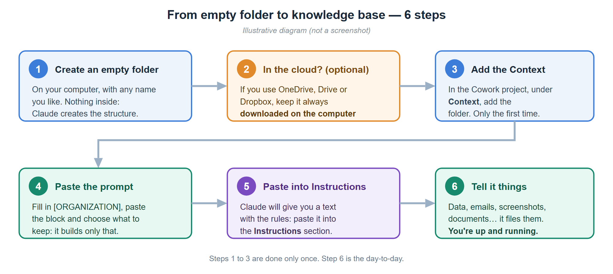
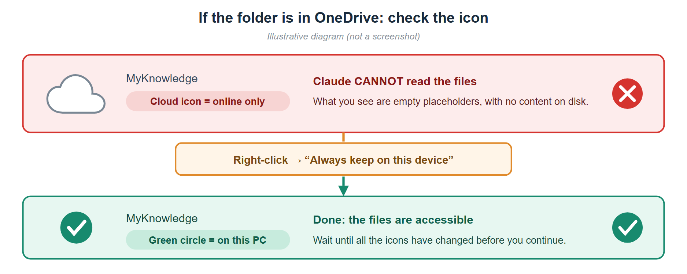
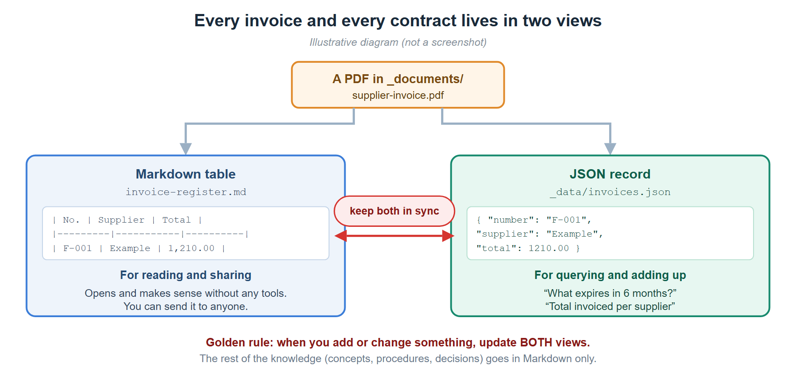
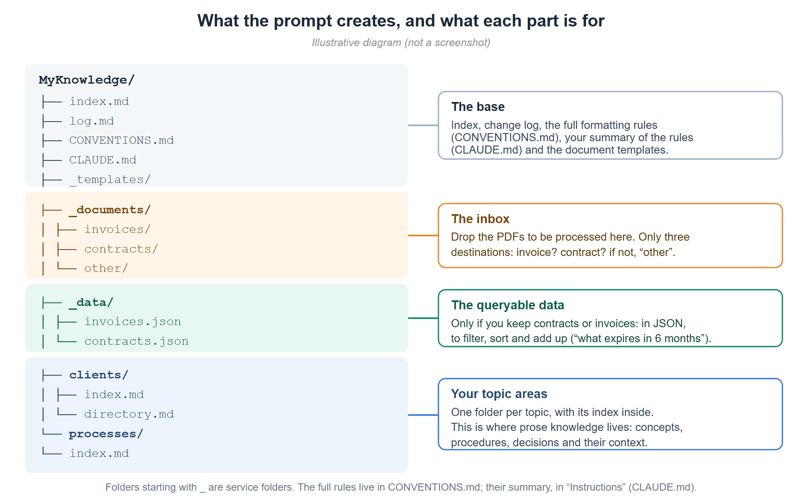
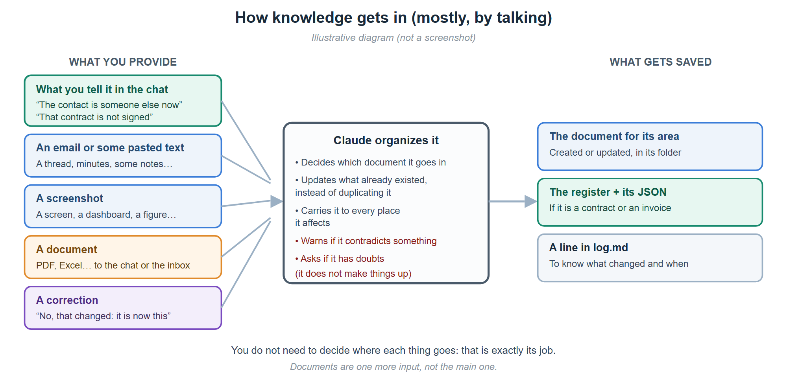
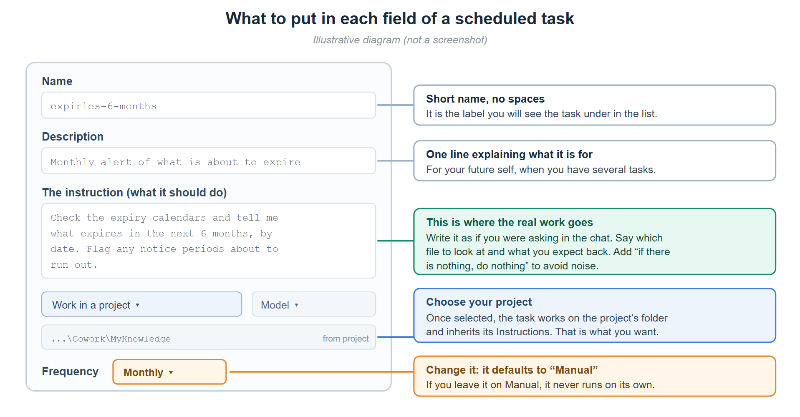

# Build your knowledge base in Cowork

*A practical guide, from an empty folder to a base that keeps itself up to date.*

## Introduction — what a knowledge base is for

### The problem it solves

An organization's knowledge is almost never where it is needed at the moment it is needed. It is
scattered across emails, folders, spreadsheets, different applications and, above all, in people's
heads. None of those pieces is wrong on its own; the problem is the sum: **nobody has the full
picture**, and rebuilding it costs more than the work you actually wanted to do.

The consequences are always the same:

- **Work gets repeated** that was already done, because it is not recorded anywhere.
- **Decisions are made on stale data**, without knowing it is stale.
- **You depend on people**: when someone is away or leaves, what they knew leaves with them.
- **There is no record of the why**, so decisions get argued again from scratch.
- And the most expensive one: **problems are found late**, when commitments have already been made.

### The goal

It is not to document more. It is for information to be **available when it is time to decide**,
to be **reliable** and to **not depend on who is in that day**. In one sentence: turn documentation
from an administrative burden into something that **actually gets consulted**.

The most useful way to picture it is as an **assistant that holds on to what you find hard to
remember** —what expires in March, which account you use to log in to each service, why that was
decided, who the contact was— with two differences from a human assistant: **it does not forget**
and **it leaves a written record** that you can read yourself.

### Three principles

Everything else follows from these three:

1. **Capture it when it happens, not later.** Knowledge is collected the moment it appears —in a
   conversation, when you open an email, when you look at a screen—, not in a later documentation
   project that never comes. If capturing it costs more than doing it, it will not get done.
2. **Every piece of data carries its date and its proof.** An inventory, a status or a figure with
   no date is indistinguishable from a stale one. And nothing is taken as true without evidence: if
   something is recorded as agreed, you must be able to point to where.
3. **A single source, with an owner.** The same fact in two places ends up as two different facts.
   Each thing lives in one place, and changes are logged so you know what changed and when.

### How it works

It is not a filing cabinet where documents are dropped. Every contribution goes through three moments:

| Moment | What happens |
|---------|------------|
| **Input** | You contribute it raw, however it comes: you tell it, paste an email, share a screenshot or drop a document. No formatting, no preparation. |
| **Cross-check** | It decides where it fits, updates what already existed instead of duplicating it, propagates it to every affected place and **warns you if it contradicts something** already stored. |
| **Query** | You ask in natural language: what expires, how much was spent, why that was decided, which account to log in with. **And whatever is worth keeping from that answer gets filed**: otherwise it stays in the chat and is lost. |

That middle step is what makes the difference. An archive accumulates; this **reconciles**: it
cross-checks the new against what was already there and brings to light what does not add up.
Mismatches are often the most valuable finding, and they only appear when the information is together.

### What holds it up

- **Fixed rules**, written once, applied in every conversation without repeating them.
- **A change log**: what was modified and when, **one line per change**. Without traceability there
  is no trust — but the log is not the place for reasoning: that goes in its document.
- **A periodic review**: a base does not break all at once, it rots slowly. Someone has to look on
  purpose for what is stale, what does not match and what was left half done.
- **Clear privacy limits**: no passwords and no sensitive personal data. You record *where* the
  secret is, not the secret.
- **And the discipline of saying "not on record"** instead of filling gaps with assumptions. A gap
  that is flagged is useful information; one that is covered up is a trap.

### From archive to capability

Well kept, a knowledge base stops being a tidy folder and becomes a **capability**: answering with
data instead of memory, seeing an expiry before it arrives, knowing what was decided and why, and
making sure that when someone leaves, what they knew does not leave with them.

It does not need a project. It needs you to start and keep telling it things.

---

To get started there are **two parts**: first you prepare the folder (5 minutes), and then you paste
**a prompt** into Claude Cowork that asks what you are going to keep and sets up only that. Weeks
later, once the base has content, there is a **third part** with the tools that keep it maintained.



---

## PART 1 — Prepare the folder

**1. Create an empty folder** on your computer, with any name you like (e.g. `MyKnowledge`).
Leave it **completely empty**: Claude will create the whole structure inside it.

**2. (Optional) If you keep it in a folder synced with the cloud**, make sure the files are really
downloaded on the computer. You do not need any cloud: a normal folder works just as well. What the
cloud gives you is **backup, version history** and the ability to open the base from another
computer; if you do not use it, remember to back up the folder from time to time.

> ⚠️ **If you use the cloud, this matters.** Many sync services (OneDrive, Google Drive,
> Dropbox…) have a mode in which the files you see are only **placeholders** with no real content
> on the disk, and then the tool **cannot read them**. You have to mark the folder so it is always
> available offline. In OneDrive, for example, it is right-click → **"Always keep on this
> device"**, and wait for the icons to change to a **green circle with a check mark**.



**3. Open Claude Desktop**, go to the **Cowork** tab and create a new **project**.

**4. Add the folder to the project.** In the project panel, under **Context**, add the folder you
have just created. The first time it will ask for permission; after that it remembers.

**5. You can now paste the prompt from Part 2.**

---

## PART 2 — The prompt

> ✏️ **This prompt is a starting point, not a closed recipe.** The first thing it does is
> **offer you eleven examples already worked through** —suppliers, contracts, invoices, budget, receipts, access,
> domains, procedures, projects, inventories and articles— and **ask which ones fit you and what other topics
> you want to keep**: the base is yours and it sets up only what you choose. Even so, adapt it freely: change the areas, add whatever you are missing (a register of customers, of incidents, of
> meetings…) and rewrite the rules that do not fit the way you work. The structure below is the
> one that works for us; **the right one is the one that reflects your day-to-day.**

**Before pasting it, replace `[ORGANIZATION]` (and, if you want, `[AREAS]`):**

- `[ORGANIZATION]` → the name of your company, team or project.
- `[AREAS]` → the subject areas you want, separated by commas
  (example: `customers, suppliers, finance, processes, people`). **It is optional**: if you leave it
  as is, Claude proposes them based on what you choose.

Copy the whole block below and paste it into Cowork:

```
I want you to build a knowledge base for [ORGANIZATION] in this folder.

What I want it for: for you to act as an assistant that keeps everything I find hard to remember or
have scattered across emails, folders, spreadsheets and different programs —expiry dates,
access details, decisions and why they were made, contacts, project status—. You store it in its
place and keep a record, so that I can ask you about it later or read it directly.

Use the OKF format (Google Cloud's Open Knowledge Format). This is the specification;
read it before you start:
https://github.com/GoogleCloudPlatform/knowledge-catalog/blob/main/okf/SPEC.md

Note: the acronym "OKF" also refers to other things (for example the Open Knowledge
Foundation). Use only the specification at the link above.

BEFORE YOU CREATE ANYTHING, ASK ME WHAT I AM GOING TO KEEP.
These are examples that already work, not a closed list: the base is mine and I build it with
my own topics. Show them to me, ask whether any of them fits me and what other topics I want to
keep. Wait for my answer and build only what the chosen ones need: the rest can be added
later with one sentence.
   1. Suppliers and contacts    -> a single directory: company, what it does and who is who.
   2. Contracts and expiry      -> contract register (table + JSON) with dates, notice periods
      dates                        and renewals.
   3. Invoices                  -> invoice register (table + JSON) linked to its contract.
   4. Budget                    -> one document per year with the budget lines, planned and
                                   actual, cross-checked with contracts and invoices.
   5. Receipts and expenses     -> monthly reconciliation of a card's charges with their
                                   receipts, and a register of the months handed in.
   6. Access to services        -> which service, its address and which account you sign in
                                   with. Never passwords.
   7. Domains, certificates     -> their renewal calendar.
      and subscriptions
   8. Procedures                -> how each thing is done, step by step.
   9. Projects and decisions    -> status, milestones and why each thing was decided.
  10. Inventories               -> equipment, licenses or software, always dated.
  11. Articles and communication -> a guide to how I write, a register of what I have published
                                   and each article with its drafts, so it writes in my voice.
If I haven't put any areas in [AREAS], suggest them based on what I choose. And before you create
each case, tell me in one line what you are going to create for it.

FORMATTING RULES (always apply them, in the future too):
- One topic = one .md file, with a kebab-case name (example: invoice-register.md).
- Every concept document starts with YAML frontmatter and the "type" field is MANDATORY.
  "type" is an open vocabulary (the spec doesn't register the values centrally), but being
  open does NOT mean free: two labels for the same thing split the vocabulary and break
  any filter by type. We will start with these four, in English and in the singular:
    Reference     -> what something is and how it is set up. The normal case.
    Procedure     -> steps to do something.
    Tool          -> record of an application or service.
    Concept       -> an idea or term, with no specific instance behind it.
  Keep the list of types in use written in the conventions document. If one day none of them
  fits and a new one is needed, ADD IT TO THAT LIST in the same change: otherwise nobody will know it
  exists and it will end up duplicated.
  Also include: title, description, tags (list) and timestamp (date YYYY-MM-DD).
- Every folder has its own index.md listing what it contains, BUT index.md files do NOT have
  frontmatter (spec §8). The only exception: the index.md at the root of the bundle, which has
  only okf_version: "0.2" and nothing else.
- Links between documents use absolute bundle paths: /folder/file.md
- There is a log.md at the root where you write down EVERY change in one line, grouped by day under a
  "## YYYY-MM-DD" header.

CREATE THIS STRUCTURE:
1. index.md at the root: general index, with the list of areas and how everything is organized
   (its only frontmatter is okf_version: "0.2").
2. log.md at the root: change diary (it starts with the line for the initial creation), and
   CONVENTIONS.md, also at the root, with the full formatting rules: it is the "conventions
   document" cited above.
3. _templates/ with index.md and one empty template per type, ready to copy:
   reference.md, procedure.md, tool.md and concept.md. Each one with its example frontmatter,
   and the "type" of each template must be its own (the concept one says Concept, not another).
4. _documents/ with a README.md explaining that it is the "inbox" where PDFs waiting to be
   processed are left, and three subfolders: invoices/, contracts/ and other/ (the last one for
   anything that is neither an invoice nor a contract: certificates, offers, minutes, reports, manuals…).
5. _data/ with index.md, invoices.json and contracts.json, ONLY if I have chosen contracts or
   invoices (see the next section).
6. One folder for each of these areas, each with its own index.md: [AREAS]
7. Whatever each chosen case needs. For example, for receipts and expenses, a monthly procedure
   and a register of months handed in; for budget, the document for the current year; for
   access, a table of services without a single password.

JSON DATA LAYER (_data/) — ONLY IF I HAVE CHOSEN CONTRACTS OR INVOICES:
Besides the Markdown tables, I want contracts and invoices in JSON, because they are
records that get filtered, sorted and added up. Create the two files with an empty array and a
"_meta" block that documents the schema, using exactly these fields:

invoices.json -> array "invoices", each element with:
  number, contract_id, date, due_date, supplier, supplier_id, description, company,
  net, tax, total, currency, recurring (true/false), notes

contracts.json -> array "contracts", each element with:
  id, subject, supplier, supplier_id, company, date, status, signed_date,
  amount, currency, duration, expiry, notice_period, historical, notes

THE LINK BETWEEN THE TWO (important, and it is what pays off most):
Almost every invoice corresponds to a contract, and almost every contract ends up in invoices. Store that
link IN ONE DIRECTION ONLY, so you don't have to maintain it twice:
- Each invoice carries "contract_id" with the id of the contract it corresponds to, or null if it is a
  one-off purchase.
- Contracts do NOT carry a list of invoices: you get it by filtering by contract_id.
With that you can ask "how much have we paid so far from this bank of hours" or "which contracts
haven't generated any invoice yet". And warn me about invoices with contract_id null that should
have one: it means something is being paid that isn't contracted in the register.

Data conventions: dates in YYYY-MM-DD format; numeric amounts without a thousands
separator; null when the fact is not recorded.

The "status" field of contracts is a CLOSED LIST declared in the _meta
(signed, invoiced, unsigned, pending_offer, to_confirm). Using an undeclared value
silently breaks the filters: if a new one is needed, it is added to the _meta in the same change.

Invoices do NOT have a "status" field: whether an invoice is paid, overdue or pending is a matter
for accounting, not for the knowledge base. A field that always said "registered" would be
read as a payment status and would be lying. Don't add it.

DECLARE THE SCOPE OF EACH REGISTER in its _meta and in the header of its table, because it changes
how they are used and can't be guessed by reading them:
- Contracts = CENSUS: they aim to be complete. If one is missing, it is a gap that has to be closed.
  Contracts that have ended are not deleted: they carry "historical": true and stay there, because "what have we
  ever contracted with X" is a real question.
- Invoices = YOU decide and write it down. If you are going to put all of them in, it is a census and they can be added up. If
  you are going to put in only some, to record that the expense exists, it is a SAMPLE and
  then you have to warn that they are NEVER added up as total spend.

In _data/index.md explain what the data layer is for, document both schemas, leave
query examples and write these two maintenance rules:
1. When you add or change a contract or an invoice you have to update BOTH VIEWS, the Markdown
   table (readable, for reading and sharing) and the JSON (structured, for querying).
2. FIRST THE JSON, THEN THE ROW. When this gets out of sync, what is missing is almost always
   the Markdown row. And if they differ: the JSON rules on hard data (dates, amounts,
   statuses) and the Markdown rules on the narrative (what the contract says, which clause matters).

Also create, for the ones I have chosen, these registers in Markdown, linked to their JSON:
- A contract register (table: contract, supplier, subject, company, date/status,
  amount) plus an "Expiry dates and renewals" section so you can answer at any
  time "what expires in the next 6 months".
- An invoice register (table: no., date, due date, supplier, description, company,
  net, VAT, total, notes).

WATCH OUT WITH "WHAT EXPIRES": contracts with suppliers are not the only thing that expires. Domains,
hosting, certificates and subscriptions have their own calendar, and they tend to expire sooner
and more often. If you keep those things in another document, MAKE THE TWO REFERENCE EACH OTHER, and
to answer "what expires in the next 6 months" always look at both. A calendar that doesn't
know the other one exists gives an incomplete answer that looks complete.

HOW WE ARE GOING TO WORK (this is the most important part):
Most of the knowledge won't reach you as documents in a folder; instead, I will
tell you about it: loose facts in the chat, emails I paste, screenshots, decisions,
clarifications and corrections to things you had already stored for me. I want you to treat that as
first-class material and file it as well as a PDF. Specifically:
- When I give you a fact or explain something, YOU decide which document in the bundle it fits in and
  store it there, without asking me where it goes. If the right document doesn't exist, create it in the
  matching area and add it to that folder's index.md.
- Before you create something new, check whether there is already a document covering that topic and
  update it instead of duplicating the information.
- THE SWEEP: if the fact affects several documents, propagate it to ALL the affected places, not
  just one. This is the step that turns a folder of files into a knowledge base,
  and it is the one most often forgotten. Always ask yourself: the folder's index.md (otherwise the page is born
  orphaned), the contact directory, the registers and their JSON, the expiry
  calendars, the inventories and the access records.
- If what I tell you contradicts something you already have stored, WARN ME by pointing out the contradiction
  instead of simply overwriting. And if it isn't recorded which one is right, WRITE IT DOWN in the
  document, with both versions, the date, where each one comes from and what it would take to
  close it. The danger is not the contradiction: it is choosing one version without leaving a trace, because
  whoever reads it later will see a clean fact and won't know there were two.
  Note: a fact that has CHANGED (a price that goes up, a contact who leaves) is not a
  contradiction, it is an update: it is replaced and re-dated.
- WHAT YOU ANSWER ME THAT IS WORTH IT, FILE IT. Much of the value doesn't appear when you store a
  document, but when you ask: a comparison, a cross-check between areas, a mismatch that shows up when
  you put the information together. That is born in the chat and dies in the chat if nobody writes it down. If an
  answer took work and would be needed again, store it as a document in the matching area
  and add it to its index.md. Signs that it's time: the question has been asked more than once, the
  answer crosses several documents, a fact appears that wasn't in any of them, or a
  decision is made and it's worth knowing WHY six months from now.
- If we review something that looked like a problem and decide that it isn't, WRITE IT DOWN WITH ITS DATE as
  reviewed and ruled out. Otherwise, it will come up again as a finding in every review and we will end up
  ignoring the warnings.
- When I correct you, correct the document and don't leave traces of the previous version unless
  the history has value; in that case, mark it clearly as superseded.
- DATE THE INFORMATION THAT EXPIRES. When you store a perishable fact —inventories and counts
  (units, equipment, licenses), statuses ("unsigned", "pending activation", "in progress"),
  figures you see on
  a screen or screenshot, prices and fees, contacts— write in brackets the date I give it
  to you: for example "340 units contracted (as of 2026-03-15)" or "pending activation
  (March 2026)". That way I'll know whether a fact is fresh or out of date. There is no
  need to date what is stable (a tax ID, a clause of a signed contract, a definition). If
  we review a dated fact and it is still valid, update the date.
- Write each change in log.md, ONE LINE PER CHANGE, under a "## YYYY-MM-DD" header for the day.
  Open a new header each day; don't pile entries under an earlier date. The log says WHAT
  changed and WHEN; it is not the place for reasoning or analysis. If a log entry
  is turning into a paragraph, that paragraph belongs in a document.
- At the end of a block of work, tell me which files you have written to.

CRITERIA YOU MUST ALWAYS RESPECT:
- Privacy: NEVER store passwords, API keys or sensitive personal data. If a
  document contains them, extract only what is needed and leave out the rest, telling me so.
- Evidence: mark something as "signed" or "contracted" ONLY if there is real evidence (signed
  document, contract in force or invoice). If it is a draft, an offer or an authorized expense,
  say so; don't treat it as signed.
- Amounts: you can store them in the knowledge base, but don't include them in documents
  meant for third parties unless I ask you to explicitly.
- When in doubt or if a fact is missing, ask me or mark it as "to confirm". Don't make it up.

When you finish:
1. Show me the tree of folders and files created.
2. Give me, in a separate text block ready to copy in one go, a summary of all the
   rules above written as standing instructions (15 lines at most). I am going to paste it
   into the "Instructions" section of this project, so: write it addressing yourself
   in the second person, without headings or embellishments, and get to the point — OKF format with the link to
   the specification, index.md without frontmatter, how to handle the knowledge that reaches you through the
   chat, where each thing goes, the rule for keeping the Markdown table in sync with the JSON, the one about dating
   the facts that expire, the one about the sweep to all the affected documents, the one about filing what
   you answer me that is worth it, and the privacy and evidence criteria.
3. Tell me how we start loading knowledge.
```

> 💡 **Pay attention to point 2: it is what makes all of this last.** The rules go in the project's
> **Instructions** section, which is what Claude applies on its own in every conversation. In the
> panel you will see that this content matches a **`CLAUDE.md`** file inside the folder: they are
> the same thing seen from the disk. The natural thing is to **edit them from the panel**.

### Why contracts and invoices come in two formats at once



Almost all knowledge is **text you read**. Contracts and invoices are the exception: they are
**records** that also get filtered, sorted and added up. That is why they live in two forms:

| | What for | What it rules on |
|---|---|---|
| **The Markdown table** | Reading, understanding and **sharing**: what the contract says, which clause matters, what to watch. | **The narrative** |
| **The JSON** | Querying and cross-checking: what expires, how much has been paid so far, what is unsigned. | **The hard data** (dates, amounts, statuses) |

It costs a little more maintenance —you have to touch both— and in return it gives you answers a
table alone cannot give. **If you do not choose contracts or invoices at the start, this layer is
not created**: for an inventory or some meeting notes it is not worth it.

> ⚠️ **The rule that prevents 90 % of the problems: JSON first, then the row.** When this gets out
> of sync, what is missing is almost always the table row — and a contract that is only in the
> JSON is invisible to whoever reads.

---

## Optional — keep the original documents

By default, the prompt above creates `_documents/` as a simple incoming **inbox**. You can leave it
there… with a warning:

> ⚠️ **The documents you pass through the chat are not saved on their own.** They live in the
> conversation, not on the disk. And transit folders (Downloads) get emptied sooner than you think.
> The extracted knowledge stays in the base, but **the original that backs it up disappears**.
>
> ✅ **The good news: it can be rescued.** You just ask — *"copy this file to
> `_documents/`"*— and Cowork saves it in the folder. What it does not do is save it **on its own**:
> if you do not ask (or leave it written in the Instructions), the original stays only in the
> conversation.

That matters in three specific situations:

1. **Proving what you claim.** If something is recorded as "signed" or "agreed", you want to be able
   to open the document. Six months later, "they sent it to me by email" is not evidence.
2. **Audits and reviews.** Whoever asks you will want the original, not a summary.
3. **Reprocessing.** If an extraction came out incomplete —common with poor-quality scans—, without
   the original it cannot be repeated.

If you are interested, **add this block to the end of the prompt** before pasting it:

```
OPTIONAL ADD-ON — ARCHIVE OF ORIGINAL DOCUMENTS
I want to keep the documents that back up what you store, not just the extracted knowledge.
Organize _documents/ with two separate functions:
- _documents/_inbox/  -> what is PENDING processing (the inbox stops being _documents/ and becomes
  this subfolder). It gets emptied: what is processed is archived or discarded.
- _documents/contracts/, _documents/invoices/ and _documents/other/  -> the ARCHIVE of what has
  been processed. "other" holds EVERYTHING that is not a contract or an invoice: certificates,
  offers and quotes, minutes, reports, manuals, screenshots of a status, technical
  documentation. That way there are only three destinations and no thinking when archiving.

Archive rules:
- Name files like this: YYYY-MM-DD_supplier_subject[_signed].ext, using the DATE OF THE
  DOCUMENT (not the archiving date). If only the month or year is known, YYYY-MM or YYYY. The
  _signed suffix only if it carries a verifiable signature.
- Archive only what PROVES something recorded in the base: contracts and addenda, accepted
  offers and quotes, certificates, invoices that support a figure in the register, evidence of
  relevant decisions. Do not archive drafts or ephemeral material.
- Do NOT archive documents with sensitive personal data: every copy widens the exposure.
- If a document already has an official repository in another system, do NOT duplicate it:
  record its location in the "resource:" field of the frontmatter of the knowledge document
  that uses it.
- When a knowledge document is based on a file in the repository, link it too with
  "resource:", so you can go from the fact to its proof.
- When I pass you a document through the chat and it has evidential value, SAVE IT in the
  matching folder of _documents/ with the naming convention, without me having to ask, and
  note it in the log. If for some reason you cannot, tell me instead of treating it as saved.
- NEVER set as "resource:" a path in a transit folder (Downloads, Desktop): those folders get
  emptied and the pointer dies without warning. Either you archive it, or you point to its
  official home.
- In registers with many sources (a table of contracts, of invoices) the citation goes IN EACH
  ROW, not in the frontmatter: "resource:" holds a single value.
- When a row does NOT have its document archived, say so explicitly in a separate list, with
  the reason. A flagged gap is information; a covered-up one makes people believe there is
  evidence when there is not.
```

> 💡 **When it is NOT worth it:** if your contracts already live in a document management system,
> in the administration system or in an official folder, **do not duplicate them**. Duplicating
> creates two truths and a copy that goes stale. In that case stick with the "record the location"
> variant and use the inbox only as a transit area.

---

## What to do next



1. **Check** that the structure is what you expected (Cowork will show you the tree).
2. **Paste the rules into "Instructions".** ← *the step you must not skip*

   At the end, Claude will have given you a **text with the rules ready to copy**. Go to your
   Cowork project panel, open **Instructions** (the `+` on the right) and paste it there.

   Why it matters: what you write in **Instructions** is applied **automatically, in every
   conversation** of the project. If you do not do it, every time you ask it to "add a document
   about X" it may do so **without following your format**, because nothing reminds it.

   > **The four sections of the project panel**, to help you find your way:
   > **Instructions** → your fixed rules (they go here) · **Memory** → what you ask it to remember ·
   > **Context** → the knowledge base folder · **Scheduled** → recurring tasks.
3. **Start telling it things.** It is the part that pays off the most, and it needs no preparation.

   

   **a) Just talking.** Drop the fact however it comes; it will put it in place:
   - *"This supplier's contact has changed: it is now So-and-so, and their email is …"*
   - *"That contract is not signed yet, there is only an offer."*
   - *"We have decided to postpone the renewal to 2027, because of cost. The reason was …"*

   **b) Pasting text.** An email, meeting minutes, some notes, a WhatsApp thread:
   > *"This is the supplier's email with the terms. Store what is relevant where it belongs."*

   **c) With screenshots.** A dashboard, an application screen, an invoice:
   > *"This is the order screen. Note the quantities and check whether they match what we had
   > recorded."*

   **d) Correcting it.** Just as important as contributing: keeping what is already there up to date.
   > *"No, that is no longer the case: it was dropped in March. Update it."*

   **e) And yes, with documents too**: straight into the chat, or by dropping them in the inbox
   (`_documents/`, or `_documents/_inbox/` if you enabled the archive of originals) to process them in batches:
   > *"Process the PDFs in the inbox and store what they say where it belongs; if they are invoices, in their register and in the JSON."*

   If you pass the document through the chat and want to **keep the original**, ask for it:
   > *"Copy this file to `_documents/` and then extract what is relevant."*

   If a PDF is **scanned** (no text layer), Cowork can read it with its vision or do
   **OCR with code** (installing a library such as `pytesseract`/`PaddleOCR` in its environment).

   > 💡 **Do not waste time deciding where each thing goes.** That is its job: you contribute the
   > knowledge raw. If it picks the wrong place, you tell it and it moves it.

4. **Query whenever you want**, in natural language:
   - *"What expires in the next 6 months?"*
   - *"Who handles support for this tool, and since when do we know?"*
   - *"What do I have pending, and which of it has a date?"*
   - *"What are we paying for that has no contract in the register?"* *(if you keep contracts and invoices)*

   > 💡 **And when an answer is good, ask it to save it.** It is the advice we took longest to
   > learn: the comparisons, cross-checks and mismatches that come out of asking **are worth more
   > than many documents**, and by default they stay in the chat and are lost.
   > *"What you just worked out, save it as a document where it belongs."*

5. **Optional but recommended: automate the maintenance.** See
   [Automate with "Scheduled"](#automate-with-scheduled).

---

## PART 3 — The growth prompt (once you have content)

Part 2 leaves the base set up and ready to use. **This part is pasted weeks later**, and it sets
up what turns a tidy folder into something that answers on its own: the **generated views**, the
**named queries** and the **health check**.

### Why this is not in the initial prompt

It is the obvious question —*if you are going to want it in the end, why not ask for everything at
once?*— and the answer is that **asking for it on day one spoils it**. For three different reasons,
and all three have happened to us.

**1. A derived view cannot derive from nothing.**
The catalog, the calendar and the mismatch report are built **from what you have already
written**. With a brand-new base, all three come out empty. And the damage is not that they are
useless that day: it is that **they teach you to ignore them**. A file you open three times and that
is always empty stops being opened — and when it finally has something in it, you no longer look.
Views should be launched when **they hurt from being full**, not when they are clean.

**2. You do not yet know which questions you will repeat.**
The queries section stores **the recipe for frequent questions**. On day one you have no frequent
questions: you have a guess about which ones they will be, and it is rarely right. Ours did not come
from thinking them up, they came from **getting fed up with repeating the same one three times**. A
query nobody runs is one more piece to maintain.

**3. Cross-check rules are written against real errors, not imagined ones.**
The mismatch report works with rules of the kind *"this is in A and should be in B"*, and each of
ours was born from a specific mismatch that took a while to sort out. Invented in advance, they come
out in two ways, both bad: **rules that never fire** —they cost and add nothing— or **rules that
always fire**, which is worse, because the noise ends up hiding the good signals and you stop
reading the whole report.

> 📌 **And there is a fourth reason, less technical and more important.** If you automate the
> maintenance before having done it by hand a few times, **you do not understand what it is
> automating or when it is lying to you**. The rules of the views —never edit them, regenerate them
> at the end— sound like bureaucracy until the day you correct something directly in a view, it gets
> regenerated over it and **you lose the change**. That lesson has to be learned beforehand, not read.

### When it is time: the signs

There is no magic number, but there are fairly reliable symptoms. **With two or three, it is time:**

- You have had to **open three or four files** to answer a question you thought was easy.
- You have asked **the same question for the third time** and searched for the answer by hand again.
- You have found **your first mismatch between two documents** — something that was in one and
  missing from the other, and nobody had noticed.
- You have relied on **a fact that was already stale**.
- You are at around **25 or 30 documents**, or the **first month** of real use has gone by.

If none of these apply, no problem: keep contributing knowledge. **The base grows on its own and
this will still be here when you need it.**

### What Part 3 adds

| Adds | What for |
|-------|----------|
| `_tools/` | The scripts that generate the views and answer the queries |
| The **five views** | Catalog · pending · calendar · **mismatches** · matches |
| `_queries/index.md` | The frequent questions **with the command that answers them** |
| `health-check.md` | What to look at in the periodic check, written once |
| `_findings.md` | The cross-checks that already proved their value, **so you do not rediscover them** |
| `events.json` · `aliases.json` | The dates that are not contract expiries, and the different names for the same thing |

> ⚠️ **This works the same in Cowork and in Claude Code**, but you notice the difference: in Cowork
> you ask it to *"regenerate the views"* and it does; in Claude Code it is a command you can run
> yourself or leave scheduled. If you have got this far, it is probably worth making the jump —
> see [The same from Claude Code](#the-same-from-claude-code).

### The prompt

Copy the block and paste it **onto the base you already have**:

```
The knowledge base already has content and it's getting big for me: to answer a
question I have to open several files. I want to add the tools that solve that.

Before you write anything, READ what is already there and tell me what you find. Don't make up generic rules:
I want them to come from MY documents.

1. GENERATED VIEWS. Write a Python script, in _tools/regenerate.py, that regenerates all of them at once,
   and create them:
   - _catalog.md     -> every document with its type, title and description, taken from the
                        frontmatter. It answers "which document talks about this".
   - _pending.md     -> every line marked as pending or warning, WITH FILE AND LINE.
                        It is fed by the markers I write (⚠️, 🚨, "- [ ]",
                        "pending", "to confirm") and an item is closed by marking the line with ✅
                        or "resolved". Start it with "what has a date", sorted by
                        proximity: that includes every future date that appears in the line, and
                        a past date only if the text talks about a deadline (before, expires,
                        lapses). Careful: most dates in the base are stamps of
                        "fact as of such a day" and are NOT deadlines; if you let them in, the view is
                        useless.
   - _calendar.md    -> expiry dates and key dates sorted by proximity.
   - _crosschecks.md -> the mismatches. See point 2.
   - _entities.md    -> identifiers (emails, tax IDs, domains) that appear in 2 or more
                        documents, with where they appear.

2. CROSS-CHECK RULES. This is the important point and I want you to do it by looking at my data:
   go through the base and propose "expected absence" rules —something that is in one document and
   should be in another— based on mismatches you ACTUALLY see. Show me the list with a
   real example of each before you code them, and we'll drop the ones that aren't worth it.

3. NAMED QUERIES. A separate script, in _tools/query.py, for the questions I repeat, and a
   _queries/index.md
   that lists them with their command. Store the RECIPE, not the answer: a written answer goes out of date
   without warning and nobody notices.

4. HEALTH CHECK. A health-check.md with what to look at periodically: dated facts older than
   six months, pending items whose date has already passed, broken links checked by opening them,
   mismatches between each table and its JSON, documents without "type" and pages that don't hang from
   any index.md.

5. _findings.md: one line for each cross-check that has already given us value, with its sources, so we don't
   discover it again. Start it with the ones you find now.

6. In _data/ (create it if it does not exist, with its index.md), add events.json (dates that
   aren't contract expiry dates: domains,
   certificates, end of support, reminders) and aliases.json (different names for the same
   thing, so the index of matches doesn't split it in two).

RULES THAT MUST BE WRITTEN DOWN in the conventions document:
- Generated views are NOT edited by hand, ever. You correct the source document and
  regenerate. A change written in the view is lost on the next run and, while it lasts,
  it lies.
- They are regenerated at the end of every block of changes.
- A pending item written without a marker is hidden, not noted. And if it has a deadline, the date goes
  on the same line.
- When a mismatch is a conscious decision and not an error, the reason is written in the
  source document so that it stops being flagged.

DON'T touch the content that already exists except to add the missing markers, and tell me beforehand
what you are going to change. When you finish, show me the tree and run the regeneration once so I
can see the views filled in.
```

> 💡 **Notice point 2**: it is the only one where it is asked to **look at your data before coding
> anything**. That is on purpose, and it is the difference between a mismatch report you read every
> week and one you end up ignoring.

### And after that

Add the **health check** as a third scheduled task (it is in
[Automate with "Scheduled"](#automate-with-scheduled)), and remember the rule that is hardest to
internalize: **when an answer in the chat took you work, ask it to file it**. The views tell you
where everything is; what is not written down, no view can save.

---

## A use case: expense receipts

Of everything you can put into the base, **what pays off most per hour invested is the dullest
thing**: photos of the receipts for a company card. It is worth telling in full because it can be
copied as is and because it shows how this really works.

**The process, before:** every month a sheet arrives with the card's charges, and it has to be sent
back with a receipt per charge. The receipts are in your wallet, in your email, on your phone or no
longer anywhere.

**The process, now:** the photo is dropped into the chat **the moment you are handed the receipt**,
without classifying anything and without writing a subject. *"This is a card expense."* When the
month's sheet arrives, you ask for the reconciliation and out comes the table with each charge, its
receipt and what is missing.

What matters is not that it adds up: it is that **the work is spread out in thirty seconds a day**,
not an entire Sunday afternoon hunting for paper.

### What you learn by doing it

**1. The name on the statement may be the card terminal's, not the shop's.**
What appears on the statement is often the **payment terminal descriptor**: a company name, some
initials or the name of the company that runs the car park, not the shop sign. →
**An unrecognizable charge is not suspicious just for being so.** It is matched by the **numeric
reference** of the entry, which is usually printed on the receipt. And when you hand it in, **write
the statement name next to the shop's**, or whoever reviews it will look for it in vain.

**2. The receipt is not always where you think.**
A hotel **prepaid through a booking platform** does not charge the bulk of the stay, so **its
invoice does not include the big charge**. The platform's receipt proves it, but it is not always
valid as an invoice. → If you need an invoice, **ask for it at the desk when you check out**: weeks
later it may never arrive.

**3. A single document can produce two charges with different destinations.**
It is common in hotels: the room goes on the company card and **the tourist tax is charged
separately**, sometimes with another card. One invoice, two entries, two destinations. → **Read the
payment lines on the invoice, not just the total.**

**4. Ask for the series, not the month.**
A single month answers *"does it add up?"*. A statement of **one or two years** at once shows what is
invisible on a single sheet: a **credit limit** that is brushed every month, old charges with no
receipt, subscriptions paid with the wrong card or **a supplier taking a disproportionate share of
the spend**. → Once a year, ask for the full series. It does not answer *does it add up?*; it
answers **what is wrong with the process?**.

**5. An empty column is a free quality indicator.**
If the sheet has a column that almost nobody fills in —the type of receipt, for example—, counting
the gaps per month gives you **the receipt backlog** with no extra work. → In any sheet you receive repeatedly,
look at which column is empty: it usually measures something.

**6. Recurring items are identified once and then no longer investigated.**
Subscriptions show up every month. Once the description is noted the first time, the following months
are recognized on their own — and their mere presence becomes a warning when one **should have moved
to another card and is still there**.

**7. Annual charges set the calendar.**
An annual subscription **can only be moved at its renewal**. If the change is not planned against
that date, it does not happen: the day passes and you are stuck with another year. → Every annual
subscription you detect deserves a reminder a few weeks before.

> 💡 **Why this works and is not "yet another expenses app".** There is nothing to classify, no
> files to name, nothing to open: you drop the photo and carry on. It puts things in order **later**,
> when it is needed. That is exactly the idea of this whole guide —**contribute raw, collect
> organized**—, and receipts are where you see it fastest.

---

## When it grows: the generated views

The first 25 or 30 documents can be handled from memory. Beyond that, something happens that you do
not see coming: **the cost stops being in reading and moves to finding**. The information is all
there, but answering *"what do I have pending?"* means opening twelve files, and in the end nobody
asks.

The solution is simple and gives a disproportionate result: **ask Claude to write some summary
files from what is already written**, and to rebuild them every time something changes.

| File | What it answers |
|---------|--------------|
| `_catalog.md` | **Which document answers what**, in a single read |
| `_pending.md` | Everything marked as pending or warning, **with file and line** |
| `_calendar.md` | Expiries and key dates **by proximity** |
| `_crosschecks.md` | **What is in one document and should be in another** |
| `_entities.md` | Where else an email, a tax ID or a domain appears |

**The one that rescues the most is `_crosschecks.md`**, and it is the least obvious. It does not look
for errors inside a document: it looks for **expected absences** between documents. *A supplier that
invoices and is not in the directory. An invoice that answers to no contract. A contract in the name
of one company and invoiced to another.* None of that raises an error anywhere — it only shows up when
someone cross-checks two lists, which is exactly what nobody does by hand.

**To ask for them, use the prompt in [Part 3](#part-3--the-growth-prompt-once-you-have-content)**, which, besides the five views, sets up
the cross-check rules, the named queries and the health check.

### Three rules so they do not turn into lies

1. 🚫 **They are not edited by hand. Ever.** You fix the source document and regenerate. A change
   written directly in the view is lost on the next run — and while it lasts, **it lies**.
2. 🔄 **They are regenerated at the end of a block of changes**; in Claude Code, a scheduled task can
   also do it every night.
3. 🏷️ **The markers are the switch.** Pending items are picked up on their own if you write `⚠️`,
   `- [ ]` or "pending"; and they **disappear** when you mark the line with `✅` or "resolved".
   A pending item written without a marker is hidden, not recorded.

> 💡 **And a detail that changes the result a lot: if something has a deadline, write the date on
> the same line.** That way the pending view can open with *what is due soon*, which is the only
> thing anyone really looks at in a hurry. "Review this before 30/11" comes out at the top;
> "review this soon" does not come out.

---

## Automate with "Scheduled"

The project's **Scheduled** section lets Claude do things **on its own, every so often**, without
you opening anything. It is what turns the knowledge base into something alive: the expiry register
no longer depends on you remembering to look at it.

When you press the `+`, the **"Create scheduled task"** form opens. This is what goes in each field:



| Field | What to put |
|-------|-----------|
| **Name** | Short label with no spaces (`expiries-6-months`). It is how you will see the task listed. |
| **Description** | One line explaining what it is for. Helpful once you have several. |
| **The instruction** (large box) | The real work: write it just as you would ask for it in the chat. |
| **Work in a project** | **Select your project.** That way the task works on the project folder and inherits its **Instructions**. |
| **Model** | Leave the default unless you have a reason. |
| **Frequency** | ⚠️ **It comes set to "Manual": change it.** If you leave it like that, it will never run on its own. |

### Three tasks that pay off

**1. Expiry alert** — *monthly frequency*

```
Name:         expiries-6-months
Description:  Monthly alert of what expires
Instruction:  Review the contract register (if you keep one) and the other expiry
              calendars —domains, subscriptions, certificates— and tell me what expires in
              the next 6 months, sorted by date. Flag those whose notice period is about
              to run out. If there are none in the window, say so in one line and do
              nothing else.
```

**2. Process whatever has arrived** — *weekly frequency*

```
Name:         pending-intake
Description:  Process new PDFs from the inbox
Instruction:  Check whether there are PDFs in the _documents/ inbox that are not already
              recorded. If there are, extract their data, store them where they belong (and
              in the table and the JSON if they are contracts or invoices), do the sweep to
              the other affected documents and record the change in log.md.
              If there is nothing new, do nothing.
```

**3. Health check** — *monthly frequency* · **the least appealing one and the one that rescues most** · *for once
you have done [Part 3](#part-3--the-growth-prompt-once-you-have-content), which creates `health-check.md`*

```
Name:         health-check
Description:  Monthly check of the state of the base
Instruction:  Review the base following health-check.md and give me a report, ordered by
              what hurts most. Look for, at least:
              1. Dated data older than 6 months (those that support a decision, first).
              2. "pending", "to confirm" or "not found" markers whose date has passed.
                 Do not repeat the ones already noted as reviewed and dismissed.
              3. Expiries in ALL calendars, not just the contracts one. Before marking
                 one as urgent, check whether it renews automatically.
              4. (If you archive originals) things marked as signed with no archived
                 document, and archived documents that do not appear in any register.
              5. (If you keep contracts and invoices) mismatches between each Markdown table
                 and its JSON, and invoices whose contract_id points to a contract that does not exist.
              6. Pages that are not linked from any index.md.
              7. Broken internal links. Check them by opening the file, not by reading the path.
              8. Documents without "type" or with a type that is not in the list of types in
                 use, and index.md files that have frontmatter (they must not).
              Apply only the obvious fixes and list them; anything that needs judgment,
              ask me. If there are no findings, say so in one line and do nothing else.
```

> 💡 **Two tricks so it does not turn into noise:**
> 1. Always end with **"if there is nothing, do nothing"**. It stops it from pinging you every week
>    to tell you there is nothing new.
> 2. Start with **manual frequency** and run it by hand once. If the result is what you expected,
>    then you give it a schedule.

---

## The same from Claude Code

Everything above works in **Cowork** without installing anything, and for most people that is more
than enough. But the folder is just a folder: **it can be opened with another tool**, and there comes
a point where it is worth it.

**Claude Code** is Claude working directly on a folder on your computer, from the desktop app or from
a terminal window. Same base, same files, another way of talking to them.

### Which to use for what

| | **Cowork** | **Claude Code** |
|---|---|---|
| **Contributing knowledge** by talking, pasting emails or screenshots | ✅ its home turf | works, but pasting is clumsier |
| **Querying** in natural language | ✅ | ✅ |
| **Unattended recurring tasks** | ✅ the *Scheduled* section | has them too |
| **Batch-processing documents** *(dozens of PDFs)* | it chokes | ✅ by far |
| **Giving the base its own utilities** *(generating the views, named queries)* | on request: you ask it to "regenerate the views" | ✅ this is exactly what it is for: a command, or a nightly task |
| **Installation** | none | needs installing |

In short: **start in Cowork**. If one day you catch yourself asking *"work this out for me again"*
for the third time, that is the sign that the calculation deserves to be a utility — and that is
where Claude Code comes in.

### How to get started

You install it once. On Windows, from a PowerShell window:

```
irm https://claude.ai/install.ps1 | iex
```

On macOS or Linux, from the terminal:

```
curl -fsSL https://claude.ai/install.sh | bash
```

*(It is the official installer; it does not need Node. It installs for your user, so do it with your
own session and not with an administrator's.)*

Then, **open your base's folder and type `claude`**. That is it: it answers about those files,
without having to add the folder to any project.

### The equivalents

What in Cowork are sections of the project, here are files inside the folder itself:

| In Cowork | In Claude Code |
|---|---|
| **Instructions** *(your fixed rules)* | a **`CLAUDE.md`** file at the root — loaded automatically when you open it |
| **Context** *(the folder)* | the folder you start from; no need to add it |
| **Scheduled** | scheduled tasks, with the same *"if there is nothing, do nothing"* criterion |

> 💡 **The `CLAUDE.md` already exists**: it is where Cowork stores the project's Instructions. Ask Claude
> Code to check that it imports the index and the conventions: *"Check that the CLAUDE.md imports
> index.md and CONVENTIONS.md"*. They are the same thing seen from two places, and you want them to stay together.

### What you really gain

It is not speed: it is that **the base starts to have tools**. The generated views from Part 3
are a script that runs with one command. And the questions that get repeated stop being
questions and become named utilities:

```
python _tools/query.py expiries 6
python _tools/query.py supplier <name>
```

> ⚠️ **Store the recipe, not the answer.** An answer written in a document goes stale without warning
> and nobody notices; a command that reads the data at that moment cannot go stale. It is the
> difference between a report and a tool.

**And the two live side by side.** Nothing stops you from contributing through Cowork from your phone
and running the utilities from Claude Code when you are at the computer: it is the same folder.

---

## Working from more than one computer: the handoff log

If the folder is in a synced cloud, on another computer **the base is all there**. What is not there is
**the conversation**: which step each topic was left at, what was expected from whom, what came next.
The log does not tell you —it says *what changed*, not *where we left it*—, and you find yourself
rebuilding from memory what you had in front of you the day before. The same happens with a single
computer when you pick something up **a week later**.

### What does not travel with the folder

| | Where it lives | What to do |
|---|---|---|
| **The conversations** | On each computer | A **handoff log** in the folder itself |
| **What the assistant has learned about you** *("this is confidential", "do not include amounts")* | In the memory of **that** computer | Move it to the **Instructions** or to `CLAUDE.md`, which do travel |
| **Scheduled tasks** | On the computer where they were created | Keep them **on one only**: if two computers regenerate the same thing every night, syncing creates conflicted copies |

### The handoff log

One file, **`handoff.md`**, at the root. **One entry per session, the most recent at the top**, with
five sections in short sentences:

- **In progress** — each topic and **the exact step** it was left at.
- **Waiting on** — who has to do what.
- **Next step.**
- **Documents touched.**
- **Warnings** — what must not be forgotten.

Only **the last ten** are kept: anything older is already in the log. And two usage rules:

1. **Read it at the start and write it at the end.** If you use Claude Code, a closing *hook* can warn
   you when documents have been touched and the handoff log has no entry for the day.
2. **Never two sessions at once on two computers.** If both write the same file almost at the same
   time, the sync service keeps one and creates a copy with the computer's name
   *(`log-MYLAPTOP.md`)*.

### The prompt

```
I want to be able to continue the work from another computer. Create a handoff.md file at the root: one
entry per session, the most recent at the top, with the header "## YYYY-MM-DD · computer" and five sections
(in progress with the exact step, waiting on, next step, documents touched, warnings). Only the
last ten entries. Explain at the start what doesn't travel between computers. Add to the Instructions
(or to CLAUDE.md) that the first entry is read at the start and a new one is written at the close, and move
there the preferences you have learned from me in this folder. The generated views must not read the
handoff log. Write the first entry with what we have open right now.
```

> 💡 **Even if you work on a single computer, it is worth it.** A two-minute entry at the end saves
> you Monday's half hour of *"where was I?"*.

---

## What we learned by breaking it

This is not theory: these are real failures of a base like this one **in its first months of life**.
None of them raised an error; all of them appeared when someone went to look on purpose. If you set
up your own, the same ones will happen to you, and sooner than you think.

**1. One false alarm wipes out all the others.**
We had written *"🚨 these domains expire in 3 days"*. They were **auto-renewed**: the date was the
billing date, not the date they would be lost. When you discover that a red warning was nothing, you
stop looking at the red ones. → **Before marking something as urgent, check whether it renews on its
own.** And with auto-renewal the risk moves: it is no longer the date, it is **the charge failing** —
with an expired card the service goes down just the same, and silently.

**2. You can have the complete data and still answer wrongly.**
The question *"what expires in the next 6 months?"* gave **a single result**. And it was true… for
the contract register. The domains and hosting had their own calendar, with ten renewals in that same
window, in another document that **was not cited from the first one**. No data was missing. → **Make
the documents that answer the same question cite each other.**

**3. `resource:` entries pointing to the Downloads folder die on their own.**
Two documents pointed to a PDF in `Downloads` as their source. The PDFs no longer existed. The
extracted knowledge was still there, but **with no way to verify it or reprocess it**. → If the
original matters, **archive it**; if it has an official home in another system, point to that home.
The Downloads folder is neither of the two.

**4. A dismissed problem comes back every month.**
We detected an expense with no associated contract; it was reviewed and the decision was not to
pursue it. Since it was not written down, the next review would have brought it up again as a new
finding. → **What is reviewed and dismissed is noted with its date.**

**5. File names can lie.**
A link to a PDF was broken and **looked perfect**: the file had *decomposed* accents (the `ó` stored
as `o` + accent, two characters instead of one). → **Links are checked by opening them, not by
reading them.**

**6. The table that splits in half.**
Someone put a block of notes in the middle of a Markdown table. The rows below stopped being a table:
**two contracts disappeared from the view** without anyone deleting them. → Long notes go **after**
the table, not inside it.

**7. What is answered in the chat evaporates.**
It is the most expensive one. Analyses, comparisons and decisions that took an afternoon and that
three months later are nowhere to be found. → See the advice in point 4 of *What to do next*.

**8. The base only knows what has gone through it.**
When we asked for the month's summary, it came out ordered by what was **documented**, not by what
had been **worked on**: the project that took the most hours appeared as one line, and two whole
fronts did not appear at all. Meetings, corridor decisions and whatever you handle outside are
invisible. → **Five minutes at the end of the week telling it what did not go through the chat.** It
is the habit with the best effort/result ratio of everything on this list.

**9. A label is not a project.**
We had a regulatory framework cited in four documents —*"this serves as evidence for X"*— and **project
X was nowhere**: no scope, no dates, no owner. The word appeared everywhere and gave the feeling of
being covered. → **If something is cited as a framework in several places, ask whether the project
document that supports it exists.**

**10. A file can disappear from the folder without anyone deleting it.**
We archived a CSV export and the **antivirus took it away** when trying to open it. The evidence was
gone and the document still pointed to it. → **Spreadsheets are archived as `.xlsx` or in Markdown,
not as CSV.** And from time to time it is worth checking that what is archived is still where it
says.

**11. A written date is not always a deadline.**
When we set up the *"what is due soon"* section, almost everything that came out as overdue was **data
dates** —*"(data from March)"*—, not deadlines. With that noise, the list was useless. →
**Distinguish the two when writing**: the date when you checked something, and the date by which
something has to be done.

**12. Classifying by name fails, and fails silently.**
We marked as *administrator accounts* everything that contained "admin", and four mailboxes from the
**Administration department** slipped in: the two words start the same way. The count came out wrong
and looked perfect. → **When you classify by text, review a sample by hand.** What separates a good
criterion from a bad one is four cases looked at closely.

**13. Two computers, one file, two versions.**
A `log-<laptop name>.md` appeared in the base next to `log.md`: a **conflicted copy** from the sync
service, with an entry that was not in the good one. Nobody had created it on purpose; two writes almost
at the same time are enough. → **Only one session open at a time**, and from time to time look for
files with a computer's name stuck on the end: they are reconciled and deleted.

**14. Rules that only one computer remembers.**
The most delicate preferences —what is confidential, what does not go into a deliverable— we had been
telling the assistant in the chat, and **they lived in its memory on that computer**. With the base
opened on another one, they would have been applied halfway or not at all. → **What must not fail is
written in the Instructions** (or in `CLAUDE.md`), which travel with the folder. Memory helps; it is
not where the rules are kept.
