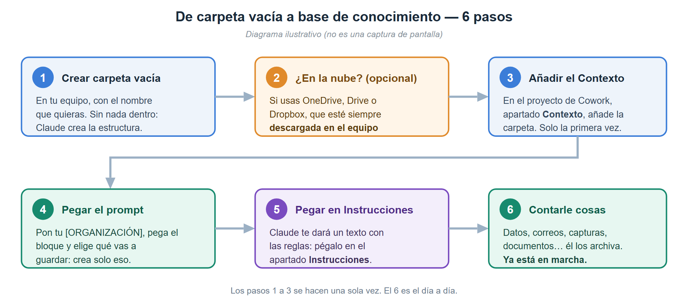
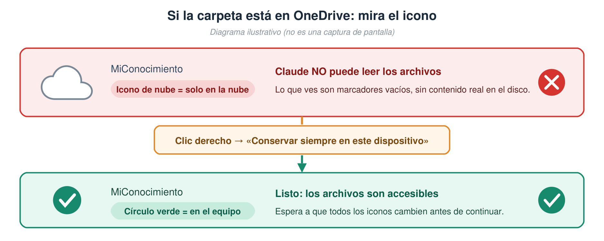
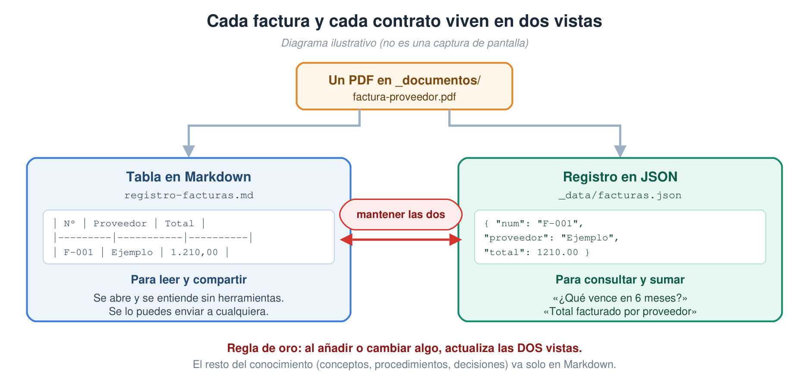
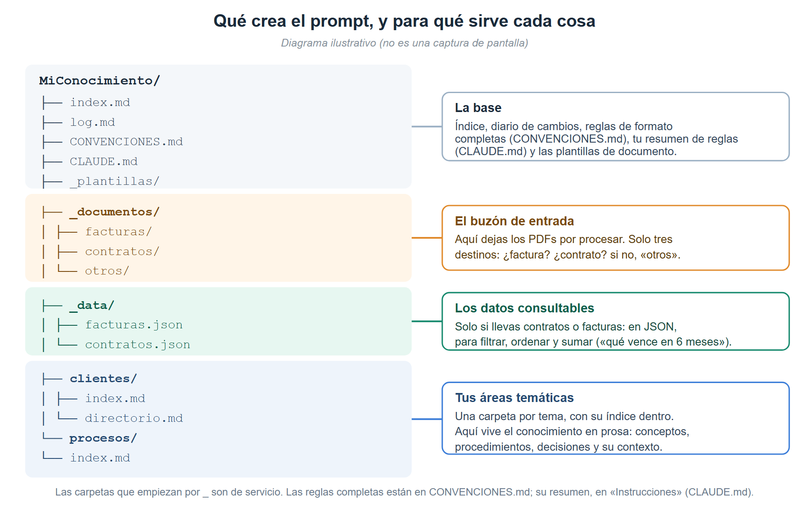
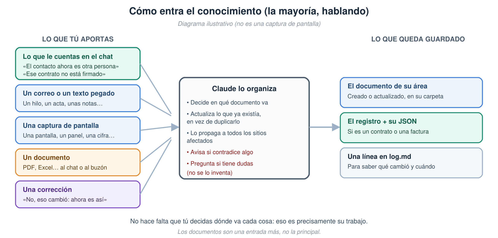
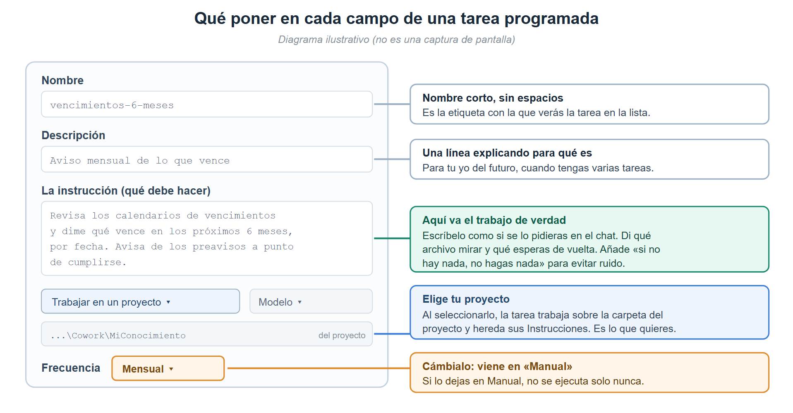

# Crear tu base de conocimiento en Cowork

*Guía práctica, de la carpeta vacía a una base que se mantiene sola.*

## Introducción — para qué sirve una base de conocimiento

### El problema que resuelve

El conocimiento de una organización casi nunca está donde hace falta en el momento en que hace
falta. Vive repartido entre correos, carpetas, hojas de cálculo, aplicaciones distintas y, sobre
todo, en la cabeza de las personas. Ninguna de esas piezas está mal por separado; el problema es la
suma: **nadie tiene la foto completa**, y reconstruirla cuesta más que el trabajo que se quería
hacer.

Las consecuencias son siempre las mismas:

- **Se repite trabajo** ya hecho, porque no consta en ningún sitio.
- **Se decide con datos caducados**, sin saber que lo están.
- **Se depende de personas**: cuando alguien falta o se va, se va con lo que sabía.
- **No queda rastro del por qué**, así que las decisiones se vuelven a discutir desde cero.
- Y lo más caro: **los problemas se descubren tarde**, cuando ya hay compromisos tomados.

### El objetivo

No es documentar más. Es que la información esté **disponible cuando toca decidir**, que sea
**fiable** y que **no dependa de quién esté ese día**. Dicho en una frase: convertir la
documentación de una carga administrativa en algo que **se consulta de verdad**.

La forma más útil de imaginarlo es como un **asistente que retiene lo que a ti te cuesta recordar**
—qué vence en marzo, con qué cuenta se entra a cada servicio, por qué se decidió aquello, quién era
el contacto— con dos diferencias frente a un asistente humano: **no olvida** y **deja constancia
escrita** que puedes leer tú mismo.

### Tres principios

Todo lo demás se deriva de estos tres:

1. **Se captura cuando ocurre, no después.** El conocimiento se recoge en el momento en que aparece
   —en una conversación, al abrir un correo, al ver una pantalla—, no en un proyecto de
   documentación posterior que nunca llega. Si capturarlo cuesta más que hacerlo, no se hará.
2. **Cada dato lleva su fecha y su prueba.** Un inventario, un estado o una cifra sin fecha es
   indistinguible de uno caducado. Y nada se da por cierto sin constancia: si algo consta como
   acordado, hay que poder señalar dónde.
3. **Una sola fuente, con dueño.** Un mismo hecho en dos sitios acaba siendo dos hechos distintos.
   Cada cosa vive en un lugar, y los cambios quedan registrados para saber qué cambió y cuándo.

### Cómo funciona

No es un archivador donde se depositan documentos. Cada aportación recorre tres momentos:

| Momento | Qué ocurre |
|---------|------------|
| **Entrada** | Aportas en crudo, como te venga: lo cuentas, pegas un correo, pasas una captura o sueltas un documento. Sin formato ni preparación. |
| **Contraste** | Se decide dónde encaja, se actualiza lo que ya existía en lugar de duplicarlo, se propaga a todos los sitios afectados y **se avisa si contradice algo** ya guardado. |
| **Consulta** | Preguntas en lenguaje natural: qué vence, cuánto se gastó, por qué se decidió aquello, con qué cuenta se entra. **Y lo que valga la pena de esa respuesta, se archiva**: si no, se queda en el chat y se pierde. |

Ese paso intermedio es el que marca la diferencia. Un archivo acumula; esto **reconcilia**: cruza lo
nuevo con lo que ya había y saca a la luz lo que no cuadra. Los descuadres suelen ser el hallazgo
más valioso, y solo aparecen cuando la información está junta.

### Lo que lo sostiene

- **Reglas fijas**, escritas una vez, que se aplican en todas las conversaciones sin repetirlas.
- **Un diario de cambios**: qué se modificó y cuándo, **una línea por cambio**. Sin trazabilidad no
  hay confianza — pero el diario no es el sitio de los razonamientos: esos van a su documento.
- **Una revisión periódica**: una base no se rompe de golpe, se pudre despacio. Alguien tiene que
  buscar a propósito lo caducado, lo descuadrado y lo que se quedó a medias.
- **Límites claros de privacidad**: ni contraseñas ni datos personales sensibles. Se registra
  *dónde* está el secreto, no el secreto.
- **Y la disciplina de decir "no consta"** en lugar de rellenar huecos con suposiciones. Un hueco
  señalado es información útil; uno tapado es una trampa.

### De archivo a capacidad

Bien llevada, una base de conocimiento deja de ser una carpeta ordenada y pasa a ser una
**capacidad**: responder con datos en vez de con memoria, ver un vencimiento antes de que llegue,
saber qué se decidió y por qué, y que la marcha de una persona no se lleve por delante lo que sabía.

No requiere un proyecto. Requiere empezar y no dejar de contarle cosas.

---

Para empezar hay **dos partes**: primero preparas la carpeta (5 minutos), y después pegas **un
prompt** en Claude Cowork que te pregunta qué vas a guardar y monta solo eso. Semanas después, cuando
la base ya tenga contenido, hay una **tercera parte** con las herramientas que la mantienen.



---

## PARTE 1 — Prepara la carpeta

**1. Crea una carpeta vacía** en tu equipo, con el nombre que quieras (p. ej. `MiConocimiento`).
Déjala **completamente vacía**: Claude creará dentro toda la estructura.

**2. (Opcional) Si la guardas en una carpeta sincronizada con la nube**, haz que los archivos
estén descargados de verdad en el equipo. No hace falta ninguna nube: una carpeta normal sirve
igual. Lo que da la nube es **copia de seguridad, historial de versiones** y poder abrir la base
desde otro equipo; si no la usas, acuérdate de hacer copia de la carpeta de vez en cuando.

> ⚠️ **Si usas nube, esto es importante.** Muchos servicios de sincronización (OneDrive, Google
> Drive, Dropbox…) tienen un modo en que los archivos que ves son solo **marcadores** sin
> contenido real en el disco, y entonces la herramienta **no puede leerlos**. Hay que marcar la
> carpeta para que esté siempre disponible sin conexión. En OneDrive, por ejemplo, es clic
> derecho → **"Conservar siempre en este dispositivo"**, y esperar a que los iconos cambien a
> **círculo verde con check**.



**3. Abre Claude Desktop**, ve a la pestaña **Cowork** y crea un **proyecto** nuevo.

**4. Añade la carpeta al proyecto.** En el panel del proyecto, apartado **Contexto**, añade la
carpeta que acabas de crear. La primera vez te pedirá permiso; después la recuerda.

**5. Ya puedes pegar el prompt de la Parte 2.**

---

## PARTE 2 — El prompt

> ✏️ **Este prompt es un punto de partida, no una receta cerrada.** Lo primero que hace es
> **ofrecerte once ejemplos ya trabajados** —proveedores, contratos, facturas, presupuesto, tickets,
> accesos, dominios, procedimientos, proyectos, inventarios y artículos— y **preguntarte cuáles te sirven y qué otros
> temas quieres llevar**: la base es tuya y monta solo lo que elijas. Aun así, adáptalo con total libertad: cambia las áreas, añade lo que te falte (un registro de clientes, de incidencias, de
> reuniones…) y reescribe las reglas que no encajen con tu forma de trabajar. La estructura de
> abajo es la que a nosotros nos funciona; **la buena es la que refleje tu día a día.**

**Antes de pegarlo, sustituye `[ORGANIZACIÓN]` (y, si quieres, `[ÁREAS]`):**

- `[ORGANIZACIÓN]` → el nombre de tu empresa, equipo o proyecto.
- `[ÁREAS]` → las áreas temáticas que quieras, separadas por comas
  (ejemplo: `clientes, proveedores, finanzas, procesos, personas`). **Es opcional**: si lo dejas tal
  cual, Claude te las propone a partir de lo que elijas.

Copia todo el bloque siguiente y pégalo en Cowork:

```
Quiero que construyas en esta carpeta una base de conocimiento para [ORGANIZACIÓN].

Para qué la quiero: que hagas de asistente que retiene todo lo que a mí me cuesta recordar o que
tengo desperdigado en correos, carpetas, hojas de cálculo y programas distintos —vencimientos,
accesos, decisiones y por qué se tomaron, contactos, estados de proyectos—. Tú lo guardas en su
sitio y dejas constancia, para que yo pueda preguntártelo después o leerlo directamente.

Usa el formato OKF (Open Knowledge Format de Google Cloud). La especificación es esta,
consúltala antes de empezar:
https://github.com/GoogleCloudPlatform/knowledge-catalog/blob/main/okf/SPEC.md

Aviso: las siglas "OKF" designan también otras cosas (por ejemplo la Open Knowledge
Foundation). Usa exclusivamente la especificación del enlace anterior.

ANTES DE CREAR NADA, PREGÚNTAME QUÉ VOY A GUARDAR.
Son ejemplos que ya funcionan, no una lista cerrada: la base es mía y la construyo con mis
propios temas. Enséñamelos, pregúntame si alguno es mi caso y qué otros temas quiero llevar.
Espera mi respuesta y monta solo lo que necesite lo elegido: lo demás se podrá añadir
más adelante con una frase.
   1. Proveedores y contactos   -> un directorio único: empresa, qué hace y quién es quién.
   2. Contratos y vencimientos  -> registro de contratos (tabla + JSON) con fechas, preavisos
                                   y renovaciones.
   3. Facturas                  -> registro de facturas (tabla + JSON) enlazado a su contrato.
   4. Presupuesto               -> un documento por año con las partidas, lo previsto y lo
                                   real, cruzado con contratos y facturas.
   5. Tickets y gastos          -> conciliación mensual de los cargos de una tarjeta con su
                                   justificante, y un registro de los meses entregados.
   6. Accesos a servicios       -> qué servicio, su dirección y con qué cuenta se entra.
                                   Nunca contraseñas.
   7. Dominios, certificados    -> su calendario de renovaciones.
      y suscripciones
   8. Procedimientos            -> cómo se hace cada cosa, paso a paso.
   9. Proyectos y decisiones    -> estado, hitos y por qué se decidió cada cosa.
  10. Inventarios               -> equipos, licencias o software, siempre con fecha.
  11. Artículos y comunicación  -> una guía de cómo escribo, un registro de lo publicado y
                                   cada artículo con sus borradores, para escribir con mi voz.
Si no he puesto áreas en [ÁREAS], propónmelas a partir de lo que elija. Y antes de crear cada
caso, dime en una línea qué vas a crear para él.

REGLAS DE FORMATO (aplícalas siempre, también en el futuro):
- Un tema = un archivo .md, con nombre en kebab-case (ejemplo: registro-facturas.md).
- Cada documento de concepto empieza con frontmatter YAML y el campo "type" es OBLIGATORIO.
  "type" es un vocabulario abierto (la spec no registra los valores centralmente), pero que sea
  abierto NO significa libre: dos etiquetas para la misma cosa parten el vocabulario y rompen
  cualquier filtro por tipo. Empezaremos con estos cuatro, en español y en singular:
    Referencia    -> qué es algo y cómo está montado. El caso normal.
    Procedimiento -> pasos para hacer algo.
    Herramienta   -> ficha de una aplicación o servicio.
    Concepto      -> una idea o término, sin instancia concreta detrás.
  Mantén la lista de tipos en uso escrita en el documento de convenciones. Si algún día ninguno
  encaja y hace falta uno nuevo, AÑÁDELO A ESA LISTA en el mismo cambio: si no, nadie sabrá que
  existe y acabará duplicado.
  Incluye también: title, description, tags (lista) y timestamp (fecha AAAA-MM-DD).
- Cada carpeta tiene su propio index.md que lista lo que contiene, PERO los index.md NO llevan
  frontmatter (spec §8). Única excepción: el index.md de la raíz del bundle, que lleva
  únicamente okf_version: "0.2" y nada más.
- Los enlaces entre documentos usan rutas absolutas del bundle: /carpeta/archivo.md
- Hay un log.md en la raíz donde anotas CADA cambio con una línea, agrupando por día bajo una
  cabecera "## AAAA-MM-DD".

CREA ESTA ESTRUCTURA:
1. index.md en la raíz: índice general, con la lista de áreas y cómo está organizado todo
   (su único frontmatter es okf_version: "0.2").
2. log.md en la raíz: diario de cambios (empieza con la línea de la creación inicial), y
   CONVENCIONES.md, también en la raíz, con las reglas de formato completas: es el "documento
   de convenciones" que se cita más arriba.
3. _plantillas/ con index.md y una plantilla vacía por cada tipo, lista para copiar:
   referencia.md, procedimiento.md, herramienta.md y concepto.md. Cada una con su frontmatter de
   ejemplo, y el "type" de cada plantilla debe ser el suyo (la de concepto dice Concepto, no otro).
4. _documentos/ con un README.md que explique que es el "buzón" donde se dejan los PDFs
   pendientes de procesar, y tres subcarpetas: facturas/, contratos/ y otros/ (esta última para
   todo lo que no sea ni factura ni contrato: certificados, ofertas, actas, informes, manuales…).
5. _data/ con index.md, facturas.json y contratos.json, SOLO si he elegido contratos o
   facturas (ver el apartado siguiente).
6. Una carpeta por cada una de estas áreas, cada una con su index.md: [ÁREAS]
7. Lo que pida cada caso elegido. Por ejemplo, para tickets y gastos, un procedimiento mensual
   y un registro de meses entregados; para presupuesto, el documento del año en curso; para
   accesos, una tabla de servicios sin ninguna contraseña.

CAPA DE DATOS EN JSON (_data/) — SOLO SI HE ELEGIDO CONTRATOS O FACTURAS:
Además de las tablas en Markdown, quiero los contratos y las facturas en JSON, porque son
registros que se filtran, ordenan y suman. Crea los dos ficheros con el array vacío y un
bloque "_meta" que documente el esquema, usando exactamente estos campos:

facturas.json -> array "facturas", cada elemento con:
  num, contrato_id, fecha, vencimiento, proveedor, proveedor_id, concepto, empresa,
  base, iva, total, moneda, recurrente (true/false), notas

contratos.json -> array "contratos", cada elemento con:
  id, objeto, proveedor, proveedor_id, empresa, fecha, estado, firma_fecha,
  importe, moneda, duracion, vencimiento, preaviso, historico, notas

EL VÍNCULO ENTRE LOS DOS (importante, y es lo que más rendimiento da):
Casi toda factura responde a un contrato, y casi todo contrato acaba en facturas. Guarda ese
vínculo EN UN SOLO SENTIDO, para no mantenerlo dos veces:
- Cada factura lleva "contrato_id" con el id del contrato al que responde, o null si es una
  compra suelta.
- Los contratos NO llevan lista de facturas: se obtiene filtrando por contrato_id.
Con eso se puede preguntar "cuánto llevamos pagado de esta bolsa de horas" o "qué contratos aún
no han generado ninguna factura". Y avísame de las facturas con contrato_id null que deberían
tener uno: significa que se está pagando algo que no está contratado en el registro.

Convenciones de los datos: fechas en formato AAAA-MM-DD; importes numéricos sin separador
de miles; null cuando el dato no consta.

El campo "estado" de los contratos es una LISTA CERRADA declarada en el _meta
(firmado, facturado, sin_firmar, oferta_pendiente, por_confirmar). Usar un valor no declarado
rompe los filtros en silencio: si hace falta uno nuevo, se añade al _meta en el mismo cambio.

Las facturas NO llevan campo "estado": si una factura está pagada, vencida o pendiente es cosa
de la contabilidad, no de la base de conocimiento. Un campo que valiera siempre "registrada" se
leería como estado de pago y estaría mintiendo. No lo añadas.

DECLARA EL ALCANCE DE CADA REGISTRO en su _meta y en la cabecera de su tabla, porque cambia
cómo se usan y no se puede adivinar leyéndolos:
- Contratos = CENSO: aspiran a estar todos. Si falta uno, es un agujero que hay que cerrar. Los
  contratos ya cerrados no se borran: llevan "historico": true y siguen ahí, porque "qué hemos
  contratado alguna vez con X" es una pregunta real.
- Facturas = decide TÚ y escríbelo. Si vas a meterlas todas, es un censo y se pueden sumar. Si
  vas a meter solo algunas para dejar constancia de que ese gasto existe, es una MUESTRA y
  entonces hay que avisar de que NUNCA se suman como gasto total.

En _data/index.md explica para qué sirve la capa de datos, documenta los dos esquemas, deja
ejemplos de consulta y escribe estas dos reglas de mantenimiento:
1. Al añadir o cambiar un contrato o una factura hay que actualizar LAS DOS VISTAS, la tabla
   Markdown (legible, para leer y compartir) y el JSON (estructurado, para consultar).
2. PRIMERO EL JSON Y DESPUÉS LA FILA. Cuando esto se desincroniza, lo que falta casi siempre es
   la fila del Markdown. Y si difieren: el JSON manda en los datos duros (fechas, importes,
   estados) y el Markdown manda en el relato (qué dice el contrato, qué cláusula importa).

Crea también, para los que haya elegido, estos registros en Markdown, enlazados con sus JSON:
- Un registro de contratos (tabla: contrato, proveedor, objeto, empresa, fecha/estado,
  importe) más una sección "Vencimientos y renovaciones" para poder responder en cualquier
  momento a "qué vence en los próximos 6 meses".
- Un registro de facturas (tabla: nº, fecha, vencimiento, proveedor, concepto, empresa,
  base, IVA, total, notas).

OJO CON "QUÉ VENCE": los contratos con proveedores no son lo único que vence. Los dominios, el
hosting, los certificados y las suscripciones tienen su propio calendario, y suelen vencer antes
y más a menudo. Si llevas esas cosas en otro documento, HAZ QUE LOS DOS SE CITEN MUTUAMENTE, y
para responder "qué vence en los próximos 6 meses" mira siempre los dos. Un calendario que no
sabe que existe el otro da una respuesta incompleta que parece completa.

CÓMO VAMOS A TRABAJAR (esto es lo más importante):
La mayor parte del conocimiento no va a llegarte como documentos en una carpeta, sino que te lo
iré contando: datos sueltos en el chat, correos que pego, capturas de pantalla, decisiones,
aclaraciones y correcciones de cosas que ya me habías guardado. Quiero que eso lo trates como
material de primera y lo archives igual de bien que un PDF. En concreto:
- Cuando te dé un dato o me explique algo, decide TÚ en qué documento del bundle encaja y
  guárdalo ahí, sin preguntarme dónde va. Si no existe el documento adecuado, créalo en el área
  que corresponda y añádelo al index.md de esa carpeta.
- Antes de crear algo nuevo, comprueba si ya existe un documento que cubra ese tema y
  actualízalo en vez de duplicar la información.
- EL BARRIDO: si el dato afecta a varios documentos, propágalo a TODOS los sitios afectados, no
  solo a uno. Este es el paso que convierte una carpeta de archivos en una base de conocimiento,
  y es el que más se olvida. Pregúntate siempre: el index.md de la carpeta (si no, la página nace
  huérfana), el directorio de contactos, los registros y sus JSON, los calendarios de
  vencimientos, los inventarios y los accesos.
- Si lo que te digo contradice algo que ya tienes guardado, AVÍSAME señalando la contradicción
  en vez de sobrescribir sin más. Y si no consta cuál es la buena, DÉJALO ESCRITO en el
  documento, con las dos versiones, la fecha, de dónde sale cada una y qué haría falta para
  cerrarla. Lo peligroso no es la contradicción: es elegir una versión sin dejar rastro, porque
  quien lo lea después verá un dato limpio y no sabrá que hubo dos.
  Ojo: que un dato haya CAMBIADO (un precio que sube, un contacto que se va) no es una
  contradicción, es una actualización: se sustituye y se refecha.
- LO QUE ME RESPONDAS Y VALGA LA PENA, ARCHÍVALO. Buena parte del valor no aparece al guardar un
  documento, sino al preguntar: una comparativa, un cruce entre áreas, un descuadre que sale al
  juntar la información. Eso nace en el chat y muere en el chat si nadie lo escribe. Si una
  respuesta ha costado trabajo y volvería a hacer falta, guárdala como documento en el área que
  toque y añádela a su index.md. Señales de que toca: la pregunta se ha hecho más de una vez, la
  respuesta cruza varios documentos, aparece un dato que no estaba en ninguno, o se toma una
  decisión y conviene saber POR QUÉ dentro de seis meses.
- Si revisamos algo que parecía un problema y decidimos que no lo es, ANÓTALO CON SU FECHA como
  revisado y descartado. Si no, volverá a salir como hallazgo en cada revisión y acabaremos
  ignorando los avisos.
- Cuando te corrija, corrige el documento y no dejes rastros de la versión anterior salvo que
  el histórico tenga valor; en ese caso, márcalo claramente como superado.
- FECHA LA INFORMACIÓN QUE CADUCA. Cuando guardes un dato perecedero —inventarios y recuentos
  (unidades, equipos, licencias), estados ("sin firmar", "pendiente de activar", "en curso"),
  cifras que veas en
  una pantalla o captura, precios y cuotas, contactos— anota entre paréntesis la fecha en que te
  lo doy: por ejemplo "340 unidades contratadas (dato de 2026-03-15)" o "pendiente de activar
  (marzo 2026)". Así sabré si un dato está fresco o caducado. No hace
  falta fechar lo estable (un CIF, una cláusula de un contrato firmado, una definición). Si
  revisamos un dato fechado y sigue vigente, actualiza la fecha.
- Anota cada cambio en log.md, UNA LÍNEA POR CAMBIO, bajo una cabecera "## AAAA-MM-DD" del día.
  Abre una cabecera nueva cada día; no acumules entradas bajo una fecha anterior. El log dice QUÉ
  cambió y CUÁNDO; no es el sitio de los razonamientos ni de los análisis. Si una entrada del log
  te está saliendo de un párrafo, ese párrafo pertenece a un documento.
- Al final de un bloque de trabajo, dime en qué archivos has escrito.

CRITERIOS QUE DEBES RESPETAR SIEMPRE:
- Privacidad: NUNCA guardes contraseñas, claves de API ni datos personales sensibles. Si un
  documento los contiene, extrae solo lo necesario y omite el resto, avisándome de ello.
- Constancia: marca algo como "firmado" o "contratado" SOLO si hay constancia real (documento
  firmado, contrato en vigor o factura). Si es un borrador, una oferta o un gasto autorizado,
  indícalo así; no lo des por firmado.
- Importes: puedes guardarlos en la base de conocimiento, pero no los incluyas en documentos
  destinados a terceros salvo que te lo pida expresamente.
- Ante la duda o si falta un dato, pregúntame o márcalo como "por confirmar". No lo inventes.

Cuando termines:
1. Muéstrame el árbol de carpetas y archivos creados.
2. Dame, en un bloque de texto aparte y listo para copiar de una vez, un resumen de todas las
   reglas anteriores redactado como instrucciones permanentes (máximo 15 líneas). Lo voy a pegar
   en el apartado "Instrucciones" de este proyecto, así que: escríbelo dirigiéndote a ti mismo
   en segunda persona, sin encabezados ni adornos, y ve al grano — formato OKF con el enlace de
   la especificación, index.md sin frontmatter, cómo tratar el conocimiento que te llegue por el
   chat, dónde va cada cosa, la regla de sincronizar la tabla Markdown con el JSON, la de fechar
   los datos que caducan, la del barrido a todos los documentos afectados, la de archivar lo que
   me respondas y valga la pena, y los criterios de privacidad y de constancia.
3. Dime cómo empezamos a cargar conocimiento.
```

> 💡 **Ojo al punto 2, es el que hace que todo esto perdure.** Las reglas van en el apartado
> **Instrucciones** del proyecto, que es lo que Claude aplica solo en cada conversación. En el
> panel verás que ese contenido se corresponde con un archivo **`CLAUDE.md`** dentro de la
> carpeta: son lo mismo visto desde el disco. Lo natural es **editarlas desde el panel**.

### Por qué contratos y facturas van en dos formatos a la vez



Casi todo el conocimiento es **texto que se lee**. Los contratos y las facturas son la excepción:
son **registros** que además se filtran, se ordenan y se suman. Por eso viven en dos formas:

| | Para qué | Quién manda |
|---|---|---|
| **La tabla Markdown** | Leer, entender y **compartir**: qué dice el contrato, qué cláusula importa, qué hay que vigilar. | **El relato** |
| **El JSON** | Consultar y cruzar: qué vence, cuánto se lleva pagado, qué está sin firmar. | **Los datos duros** (fechas, importes, estados) |

Cuesta un poco más de mantenimiento —hay que tocar los dos— y a cambio te da respuestas que una
tabla sola no puede dar. **Si no eliges contratos ni facturas al empezar, esta capa no se crea**: para
un inventario o unas notas de reunión no compensa.

> ⚠️ **La regla que evita el 90 % de los problemas: primero el JSON, después la fila.** Cuando esto
> se desincroniza, lo que falta casi siempre es la fila de la tabla — y un contrato que solo está
> en el JSON es invisible para quien lee.

---

## Opcional — conservar los documentos originales

Por defecto, el prompt anterior crea `_documentos/` como simple **buzón** de entrada. Puedes
quedarte ahí… con una advertencia:

> ⚠️ **Los documentos que pasas por el chat no se guardan solos.** Viven en la conversación, no en
> el disco. Y las carpetas de tránsito (Descargas) se vacían antes de lo que uno cree. El
> conocimiento extraído queda en la base, pero **el original que lo respalda desaparece**.
>
> ✅ **La buena noticia: sí se puede rescatar.** Basta pedirlo — *"copia este archivo a
> `_documentos/`"*— y Cowork lo guarda en la carpeta. Lo que no hace es guardarlo **por su cuenta**:
> si no se lo pides (o no se lo dejas escrito en las Instrucciones), el original se queda solo en
> la conversación.

Eso importa en tres situaciones concretas:

1. **Demostrar lo que afirmas.** Si algo figura como "firmado" o "acordado", conviene poder abrir
   el documento. A los seis meses, "me lo pasaron por correo" no es constancia.
2. **Auditorías y revisiones.** Quien te pregunte querrá el original, no un resumen.
3. **Reprocesar.** Si una extracción salió incompleta —habitual con escaneos de mala calidad—, sin
   el original no se puede repetir.

Si te interesa, **añade este bloque al final del prompt** antes de pegarlo:

```
AÑADIDO OPCIONAL — ARCHIVO DE DOCUMENTOS ORIGINALES
Quiero conservar los documentos que respaldan lo que guardas, no solo el conocimiento extraído.
Organiza _documentos/ con dos funciones separadas:
- _documentos/_buzon/  -> lo PENDIENTE de procesar (el buzón deja de ser _documentos/ y pasa a ser
  esta subcarpeta). Se vacía: lo procesado se archiva o se descarta.
- _documentos/contratos/, _documentos/facturas/ y _documentos/otros/  -> el ARCHIVO de lo ya
  procesado. En "otros" va TODO lo que no sea contrato ni factura: certificados, ofertas y
  presupuestos, actas, informes, manuales, capturas de un estado, documentación técnica. Así solo
  hay tres destinos y no hay que pensar al archivar.

Reglas del archivo:
- Nombra los archivos así: AAAA-MM-DD_proveedor_objeto[_firmado].ext, usando la FECHA DEL
  DOCUMENTO (no la de archivado). Si solo se conoce el mes o el año, AAAA-MM o AAAA. El sufijo
  _firmado solo si lleva firma verificable.
- Archiva solo lo que ACREDITE algo registrado en la base: contratos y adendas, ofertas y
  presupuestos aceptados, certificados, facturas que sostengan un dato del registro, evidencia de
  decisiones relevantes. No archives borradores ni material efímero.
- NO archives documentos con datos personales sensibles: cada copia amplía la exposición.
- Si un documento ya tiene un repositorio oficial en otro sistema, NO lo dupliques: apunta su
  ubicación en el campo "resource:" del frontmatter del documento de conocimiento que lo usa.
- Cuando un documento del conocimiento se base en un archivo del repositorio, enlázalo también
  con "resource:", para poder ir del dato a su prueba.
- Cuando te pase un documento por el chat y tenga valor probatorio, GUÁRDALO en la carpeta que le
  corresponda de _documentos/ con el nombre de la convención, sin que yo tenga que pedírtelo, y
  déjalo anotado en el log. Si por algo no puedes, avísame en vez de darlo por guardado.
- NUNCA pongas como "resource:" una ruta de una carpeta de tránsito (Descargas, Escritorio): esas
  carpetas se vacían y el puntero se muere sin avisar. O lo archivas, o apuntas su casa oficial.
- En los registros con muchas fuentes (una tabla de contratos, de facturas) la cita va EN CADA
  FILA, no en el frontmatter: "resource:" es de valor único.
- Cuando una fila NO tenga su documento archivado, dilo explícitamente en una lista aparte, con el
  motivo. Un hueco señalado es información; uno tapado hace creer que hay constancia cuando no la
  hay.
```

> 💡 **Cuándo NO merece la pena:** si tus contratos ya viven en un gestor documental, en el
> sistema de administración o en una carpeta oficial, **no los dupliques**. Duplicar crea dos
> verdades y una copia que se queda vieja. En ese caso quédate con la variante de "apuntar la
> ubicación" y usa el buzón solo como zona de paso.

---

## Qué hacer después



1. **Comprueba** que la estructura es la que esperabas (Cowork te mostrará el árbol).
2. **Pega las reglas en «Instrucciones».** ← *el paso que no hay que saltarse*

   Al final, Claude te habrá dado un **texto con las reglas listo para copiar**. Ve al panel de
   tu proyecto de Cowork, abre **Instrucciones** (el `+` de la derecha) y pégalo ahí.

   Por qué importa: lo que escribes en **Instrucciones** se aplica **solo, en todas las
   conversaciones** del proyecto. Si no lo haces, cada vez que le pidas "añade un documento
   sobre X" puede hacerlo **sin seguir tu formato**, porque no hay nada que se lo recuerde.

   > **Los cuatro apartados del panel del proyecto**, para orientarte:
   > **Instrucciones** → tus reglas fijas (aquí van) · **Memoria** → lo que le pidas recordar ·
   > **Contexto** → la carpeta de la base de conocimiento · **Programado** → tareas recurrentes.
3. **Empieza a contarle cosas.** Es la parte que más rendimiento da, y no requiere preparar nada.

   

   **a) Hablando, sin más.** Suelta el dato como te venga; ya lo colocará él:
   - *"El contacto de este proveedor ha cambiado: ahora es Fulano, y su email es …"*
   - *"Ese contrato no está firmado todavía, solo hay una oferta."*
   - *"Hemos decidido posponer la renovación a 2027, por coste. El motivo fue …"*

   **b) Pegando texto.** Un correo, un acta de reunión, unas notas, un hilo de WhatsApp:
   > *"Este es el correo del proveedor con las condiciones. Guarda lo relevante donde toque."*

   **c) Con capturas de pantalla.** Un panel, una pantalla de una aplicación, una factura:
   > *"Esta es la pantalla del pedido. Apunta las cantidades y comprueba si cuadran con lo que
   > teníamos anotado."*

   **d) Corrigiéndole.** Igual de importante que aportar: mantener al día lo que ya está.
   > *"No, eso ya no es así: se descartó en marzo. Actualízalo."*

   **e) Y sí, también con documentos**: al chat directamente, o dejándolos en el buzón
   (`_documentos/`, o `_documentos/_buzon/` si activaste el archivo de originales) para procesarlos en lote:
   > *"Procesa los PDFs del buzón y guarda lo que digan donde toque; si son facturas, en su registro y en el JSON."*

   Si el documento lo pasas por el chat y quieres **conservar el original**, pídelo:
   > *"Copia este archivo a `_documentos/` y luego extrae lo relevante."*

   Si un PDF está **escaneado** (sin capa de texto), Cowork puede leerlo con su visión o hacer
   **OCR con código** (instalando una librería tipo `pytesseract`/`PaddleOCR` en su entorno).

   > 💡 **No pierdas tiempo decidiendo dónde va cada cosa.** Ese es su trabajo: tú aporta el
   > conocimiento en crudo. Si se equivoca de sitio, se lo dices y lo mueve.

4. **Consulta cuando quieras**, en lenguaje natural:
   - *"¿Qué vence en los próximos 6 meses?"*
   - *"¿Quién lleva el soporte de esta herramienta, y desde cuándo lo sabemos?"*
   - *"¿Qué tengo pendiente, y qué de eso tiene fecha?"*
   - *"¿Qué estamos pagando que no tenga contrato en el registro?"* *(si llevas contratos y facturas)*

   > 💡 **Y cuando una respuesta sea buena, pídele que la guarde.** Es el consejo que más tardamos
   > en aprender: las comparativas, los cruces y los descuadres que salen preguntando **valen más
   > que muchos documentos**, y por defecto se quedan en el chat y se pierden.
   > *"Esto que acabas de sacar, guárdalo como documento donde toque."*

5. **Opcional pero recomendable: automatiza el mantenimiento.** Ver
   [Automatizar con «Programado»](#automatizar-con-programado).

---

## PARTE 3 — El prompt de crecimiento (cuando ya tengas contenido)

La Parte 2 deja la base montada y lista para usar. **Esta parte se pega semanas después**, y monta
lo que convierte una carpeta ordenada en algo que responde solo: las **vistas generadas**, las
**consultas con nombre** y la **revisión de salud**.

### Por qué esto no está en el prompt inicial

Es la pregunta obvia —*si al final lo vas a querer, ¿por qué no pedirlo todo de golpe?*— y la
respuesta es que **pedirlo el primer día lo estropea**. Por tres motivos distintos, y los tres nos
han pasado.

**1. Una vista derivada no puede derivar de nada.**
El catálogo, el calendario y el informe de descuadres se construyen **a partir de lo que ya has
escrito**. Con la base recién creada salen los tres vacíos. Y el daño no es que no sirvan ese día:
es que **te enseñan a ignorarlos**. Un archivo que abres tres veces y siempre está vacío deja de
abrirse — y cuando por fin tenga algo dentro, ya no lo miras. Las vistas hay que estrenarlas
cuando **duelen de llenas**, no cuando están limpias.

**2. Todavía no sabes qué preguntas vas a repetir.**
El apartado de consultas guarda **la receta de las preguntas frecuentes**. El primer día no tienes
preguntas frecuentes: tienes una suposición sobre cuáles serán, y se acierta poco. Las nuestras no
salieron de pensarlas, salieron de **hartarnos de repetir la misma tres veces**. Una consulta que
nadie hace es una pieza más que mantener.

**3. Las reglas de cruce se escriben contra errores reales, no imaginados.**
El informe de descuadres funciona con reglas del tipo *«esto está en A y debería estar en B»*, y
cada una de las nuestras nació de un descuadre concreto que costó un rato. Inventadas de antemano
salen de dos formas, las dos malas: **reglas que no saltan nunca** —cuestan y no aportan— o
**reglas que saltan siempre**, que es peor, porque el ruido acaba tapando las señales buenas y
dejas de leer el informe entero.

> 📌 **Y hay un cuarto motivo, menos técnico y más importante.** Si automatizas el mantenimiento
> antes de haberlo hecho a mano unas cuantas veces, **no entiendes qué está automatizando ni
> cuándo te está mintiendo**. Las reglas de las vistas —no editarlas nunca, regenerarlas al
> cerrar— suenan a burocracia hasta el día en que corriges algo directamente en una vista, se
> regenera encima y **pierdes el cambio**. Esa lección hay que llevársela antes, no leerla.

### Cuándo toca: las señales

No hay un número mágico, pero sí síntomas bastante fiables. **Con dos o tres, ya toca:**

- Has tenido que **abrir tres o cuatro archivos** para responder una pregunta que creías fácil.
- Has hecho **la misma pregunta por tercera vez** y has vuelto a buscar la respuesta a mano.
- Has encontrado **tu primer descuadre entre dos documentos** — algo que estaba en uno y faltaba
  en el otro, y nadie lo había notado.
- Te has fiado de **un dato que ya estaba caducado**.
- Rondas los **25 o 30 documentos**, o ha pasado el **primer mes** de uso real.

Si no se cumple ninguna, no pasa nada: sigue aportando conocimiento. **La base crece sola y esto
seguirá aquí cuando haga falta.**

### Qué añade la Parte 3

| Añade | Para qué |
|-------|----------|
| `_herramientas/` | Los scripts que generan las vistas y responden las consultas |
| Las **cinco vistas** | Catálogo · pendientes · calendario · **descuadres** · coincidencias |
| `_consultas/index.md` | Las preguntas frecuentes **con el comando que las responde** |
| `revision-salud.md` | Qué mirar en el chequeo periódico, escrito una vez |
| `_hallazgos.md` | Los cruces que ya dieron valor, **para no redescubrirlos** |
| `eventos.json` · `alias.json` | Las fechas que no son vencimientos de contrato, y los nombres distintos de una misma cosa |

> ⚠️ **Esto funciona igual en Cowork y en Claude Code**, pero se nota la diferencia: en Cowork le
> pides *«regenera las vistas»* y lo hace; en Claude Code es un comando que puedes lanzar tú o
> dejar programado. Si has llegado hasta aquí, es probable que te compense dar el salto —
> ver [Lo mismo desde Claude Code](#lo-mismo-desde-claude-code).

### El prompt

Copia el bloque y pégalo **sobre la base que ya tienes**:

```
La base de conocimiento ya tiene contenido y se me está haciendo grande: para responder una
pregunta tengo que abrir varios archivos. Quiero añadirle las herramientas que lo resuelven.

Antes de escribir nada, LEE lo que ya hay y dime qué encuentras. No inventes reglas genéricas:
quiero que salgan de MIS documentos.

1. VISTAS GENERADAS. Escribe un script en Python, en _herramientas/regenerar.py, que las regenere todas de una vez,
   y créalas:
   - _catalogo.md    -> todos los documentos con su tipo, título y descripción, sacados del
                        frontmatter. Responde "qué documento habla de esto".
   - _pendientes.md  -> cada línea marcada como pendiente o aviso, CON ARCHIVO Y LÍNEA.
                        Se alimenta de los marcadores que yo escriba (⚠️, 🚨, "- [ ]",
                        "pendiente", "por confirmar") y se cierra marcando la línea con ✅
                        o "resuelto". Encabézalo con "lo que tiene fecha", ordenado por
                        proximidad: ahí entra toda fecha futura que aparezca en la línea, y
                        una fecha pasada solo si el texto habla de plazo (antes del, vence,
                        caduca). Ojo: la mayoría de las fechas de la base son sellos de
                        "dato de tal día" y NO son vencimientos; si las cuelas, la vista no
                        sirve.
   - _calendario.md  -> vencimientos y fechas clave ordenados por proximidad.
   - _cruces.md      -> los descuadres. Ver el punto 2.
   - _entidades.md   -> identificadores (correos, CIF, dominios) que aparezcan en 2 o más
                        documentos, con dónde salen.

2. REGLAS DE CRUCE. Este es el punto importante y quiero que lo hagas mirando mis datos:
   revisa la base y proponme reglas de "ausencia esperada" —algo que está en un documento y
   debería estar en otro— basadas en descuadres que veas DE VERDAD. Enséñame la lista con un
   ejemplo real de cada una antes de programarlas, y descartamos las que no valgan.

3. CONSULTAS CON NOMBRE. Un script aparte, en _herramientas/consultar.py, para las preguntas que
   repito, y un _consultas/index.md
   que las liste con su comando. Guarda la RECETA, no la respuesta: una respuesta escrita caduca
   sin avisar y nadie se entera.

4. REVISIÓN DE SALUD. Un revision-salud.md con qué mirar periódicamente: datos fechados de hace
   más de seis meses, pendientes cuya fecha ya pasó, enlaces rotos comprobados abriéndolos,
   descuadres entre cada tabla y su JSON, documentos sin "type" y páginas que no cuelgan de
   ningún index.md.

5. _hallazgos.md: una línea por cada cruce que ya nos haya dado valor, con sus fuentes, para no
   volver a descubrirlo. Arráncalo con los que encuentres ahora.

6. En _data/ (créala si no existe, con su index.md), añade eventos.json (fechas que no son
   vencimientos de contrato: dominios,
   certificados, fines de soporte, recordatorios) y alias.json (nombres distintos para la misma
   cosa, para que el índice de coincidencias no la parta en dos).

REGLAS QUE DEBEN QUEDAR ESCRITAS en el documento de convenciones:
- Las vistas generadas NO se editan a mano, nunca. Se corrige el documento de origen y se
  regenera. Un cambio escrito en la vista se pierde en la siguiente pasada y, mientras dura,
  miente.
- Se regeneran al terminar cada bloque de cambios.
- Un pendiente escrito sin marcador está escondido, no anotado. Y si tiene plazo, la fecha va
  en la misma línea.
- Cuando un descuadre sea una decisión consciente y no un error, se anota el motivo en el
  documento de origen para que deje de saltar.

NO toques el contenido que ya existe salvo para añadir los marcadores que falten, y dime antes
qué vas a cambiar. Al terminar, enséñame el árbol y ejecuta la regeneración una vez para que yo
vea las vistas llenas.
```

> 💡 **Fíjate en el punto 2**: es el único donde se le pide que **mire tus datos antes de
> programar nada**. Es a propósito, y es la diferencia entre un informe de descuadres que lees
> cada semana y uno que acabas ignorando.

### Y después

Añade la **revisión de salud** como tercera tarea programada (está en
[Automatizar con «Programado»](#automatizar-con-programado)), y acuérdate de la regla que más
cuesta interiorizar: **cuando una respuesta del chat te haya costado trabajo, pídele que la
archive**. Las vistas te dicen dónde está todo; lo que no está escrito, no lo salva ninguna vista.

---

## Un caso de uso: los tickets de gasto

De todo lo que se puede meter en la base, **lo que más rendimiento da por hora invertida es lo más
tonto**: las fotos de los tickets de una tarjeta de empresa. Vale la pena contarlo entero porque
se copia tal cual y porque enseña cómo funciona esto de verdad.

**El proceso, antes:** cada mes llega una hoja con los cargos de la tarjeta, y hay que devolverla con
un justificante por cargo. Los tickets están en la cartera, en el correo, en el móvil o ya no están.

**El proceso, ahora:** la foto se suelta en el chat **en el momento en que te dan el ticket**, sin
clasificar nada y sin escribir un asunto. *«Este es un gasto de la tarjeta.»* Al llegar la hoja del
mes, se pide la conciliación y sale el cuadro con cada cargo, su justificante y lo que falta.

Lo importante no es que cuadre: es que **el trabajo se hace repartido en treinta segundos por día**,
no en una tarde de domingo buscando papeles.

### Lo que se aprende haciéndolo

**1. El nombre del extracto puede ser el del datáfono, no el del comercio.**
Lo que aparece en el extracto es a menudo el **descriptor del terminal de pago**: una razón social,
unas siglas o el nombre de la empresa que gestiona el aparcamiento, no el rótulo de la tienda. →
**Un cargo irreconocible no es sospechoso por serlo.** Se empareja por la **referencia numérica**
del apunte, que suele venir impresa en el ticket. Y al entregarlo, **apunta el nombre del extracto
junto al del comercio**, o quien lo revise lo buscará en vano.

**2. El justificante no siempre está donde crees.**
Un hotel **prepagado a través de una plataforma de reservas** no cobra el grueso de la estancia, así
que **su factura no incluye el cargo grande**. El recibo de la plataforma lo prueba, pero no siempre
vale como factura. → Si hace falta factura, **se pide en el mostrador al salir**: semanas después
puede no llegar nunca.

**3. Un solo documento puede producir dos cargos con destinos distintos.**
En los hoteles es frecuente: la habitación va con la tarjeta de empresa y **la tasa turística se
cobra aparte**, a veces con otra tarjeta. Una factura, dos apuntes, dos destinos. → **Lee las líneas
de pago de la factura, no solo el total.**

**4. Pide la serie, no el mes.**
El mes suelto responde *«¿cuadra?»*. Un extracto de **uno o dos años** de golpe enseña lo que en una
sola hoja es invisible: un **límite de crédito** que se roza todos los meses, cargos antiguos sin
justificante, suscripciones pagadas con la tarjeta equivocada o **un proveedor que se lleva una parte
desproporcionada del gasto**. → Una vez al año, pide la serie completa. No responde *¿cuadra?*;
responde **¿qué está mal en el proceso?**.

**5. Una columna vacía es un indicador de calidad gratis.**
Si la hoja trae una columna que casi nadie rellena —el tipo de justificante, por ejemplo—, contar
los huecos por mes da **el atraso de justificación** sin trabajo adicional. → En cualquier hoja que te llegue repetida,
mira qué columna está vacía: suele medir algo.

**6. Lo recurrente se identifica una vez y deja de investigarse.**
Las suscripciones aparecen todos los meses. Anotado el concepto la primera vez, los meses siguientes
se reconocen solos — y su sola presencia se vuelve un aviso cuando alguna **debería haber cambiado de
tarjeta y sigue ahí**.

**7. Los cargos anuales mandan el calendario.**
Una suscripción anual **solo se puede mover en su renovación**. Si el cambio no se planifica contra
esa fecha, no ocurre: se pasa el día y te comes otro año. → Cada suscripción anual detectada merece un
recordatorio unas semanas antes.

> 💡 **Por qué esto funciona y no es «otra app de gastos».** No hay que clasificar, ni nombrar
> archivos, ni abrir nada: sueltas la foto y sigues. El orden lo pone él **después**, cuando hace
> falta. Esa es exactamente la idea de toda esta guía —**aportar en crudo, recoger ordenado**—, y los
> tickets son donde se ve más rápido.

---

## Cuando crezca: las vistas generadas

Los primeros 25 o 30 documentos se manejan de memoria. A partir de ahí pasa algo que no se ve venir:
**el coste deja de estar en leer y pasa a estar en localizar**. La información está toda, pero
responder *«¿qué tengo pendiente?»* obliga a abrir doce archivos, y al final no se pregunta.

La solución es sencilla y da un resultado desproporcionado: **pídele a Claude que escriba unos
archivos resumen a partir de lo que ya está escrito**, y que los rehaga cada vez que cambie algo.

| Archivo | Qué responde |
|---------|--------------|
| `_catalogo.md` | **Qué documento responde a qué**, en una sola lectura |
| `_pendientes.md` | Todo lo marcado como pendiente o aviso, **con archivo y línea** |
| `_calendario.md` | Vencimientos y fechas clave **por proximidad** |
| `_cruces.md` | **Lo que está en un documento y debería estar en otro** |
| `_entidades.md` | Dónde más aparece un correo, un CIF, un dominio |

**El que más rescata es `_cruces.md`**, y es el menos evidente. No busca errores dentro de un
documento: busca **ausencias esperadas** entre documentos. *Un proveedor que factura y no está en
el directorio. Una factura que no responde a ningún contrato. Un contrato a nombre de una empresa
y facturado a otra.* Nada de eso da error en ninguna parte — solo aparece cuando alguien cruza dos
listas, que es exactamente lo que nadie hace a mano.

**Para pedirlas, usa el prompt de la [Parte 3](#parte-3--el-prompt-de-crecimiento-cuando-ya-tengas-contenido)**, que además de las cinco vistas monta
las reglas de cruce, las consultas con nombre y la revisión de salud.

### Tres reglas para que no se conviertan en mentira

1. 🚫 **No se editan a mano. Nunca.** Se corrige el documento de origen y se regenera. Un cambio
   escrito directamente en la vista se pierde en la siguiente pasada — y mientras dure, **miente**.
2. 🔄 **Se regeneran al terminar un bloque de cambios**; en Claude Code, además, puede hacerlo una
   tarea programada cada noche.
3. 🏷️ **Los marcadores son el interruptor.** Los pendientes se recogen solos si escribes `⚠️`,
   `- [ ]` o «pendiente»; y **desaparecen** cuando marcas la línea con `✅` o «resuelto».
   Un pendiente escrito sin marcador está escondido, no anotado.

> 💡 **Y un detalle que cambia mucho el resultado: si algo tiene plazo, escribe la fecha en la
> misma línea.** Así la vista de pendientes puede encabezarse con *lo que vence pronto*, que es
> lo único que de verdad se mira con prisa. «Revisar esto antes del 30/11» sale arriba;
> «revisar esto pronto», no sale.

---

## Automatizar con «Programado»

El apartado **Programado** del proyecto sirve para que Claude haga cosas **por su cuenta, cada
cierto tiempo**, sin que tú abras nada. Es lo que convierte la base de conocimiento en algo vivo:
el registro de vencimientos deja de depender de que te acuerdes de mirarlo.

Al pulsar el `+` se abre el formulario **«Crear tarea programada»**. Esto es lo que va en cada campo:



| Campo | Qué poner |
|-------|-----------|
| **Nombre** | Etiqueta corta y sin espacios (`vencimientos-6-meses`). Es como verás la tarea listada. |
| **Descripción** | Una línea explicando para qué es. Se agradece cuando tengas varias. |
| **La instrucción** (recuadro grande) | El trabajo de verdad: escríbelo tal como se lo pedirías en el chat. |
| **Trabajar en un proyecto** | **Selecciona tu proyecto.** Así la tarea trabaja sobre la carpeta del proyecto y hereda sus **Instrucciones**. |
| **Modelo** | Déjalo en el predeterminado salvo que tengas una razón. |
| **Frecuencia** | ⚠️ **Viene en «Manual»: cámbialo.** Si lo dejas así, no se ejecutará solo nunca. |

### Tres tareas que compensan

**1. Aviso de vencimientos** — *frecuencia mensual*

```
Nombre:       vencimientos-6-meses
Descripción:  Aviso mensual de lo que vence
Instrucción:  Revisa el registro de contratos (si lo llevas) y los demás calendarios de
              vencimientos —dominios, suscripciones, certificados— y dime qué vence en los
              próximos 6 meses, ordenado por fecha. Señala los que tengan el plazo de preaviso
              a punto de cumplirse. Si no hay ninguno en ventana, dilo en una línea y no hagas
              nada más.
```

**2. Procesar lo que haya llegado** — *frecuencia semanal*

```
Nombre:       ingesta-pendiente
Descripción:  Procesar PDFs nuevos del buzón
Instrucción:  Mira si hay PDFs en el buzón de _documentos/ que no estén ya registrados. Si
              hay, extrae sus datos, guárdalos donde toque (y en la tabla y el JSON si son
              contratos o facturas), haz el barrido a los demás documentos afectados y anota
              el cambio en log.md.
              Si no hay nada nuevo, no hagas nada.
```

**3. Revisión de salud** — *frecuencia mensual* · **la que menos apetece y más rescata** · *para cuando
hayas hecho la [Parte 3](#parte-3--el-prompt-de-crecimiento-cuando-ya-tengas-contenido), que crea `revision-salud.md`*

```
Nombre:       revision-salud
Descripción:  Chequeo mensual del estado de la base
Instrucción:  Revisa la base siguiendo revision-salud.md y dame un informe, ordenado por lo
              que más duele. Busca, como mínimo:
              1. Datos fechados con más de 6 meses (los que sostienen una decisión, primero).
              2. Marcadores "pendiente", "por confirmar" o "no localizado" cuya fecha ya pasó.
                 No repitas los que ya estén anotados como revisados y descartados.
              3. Vencimientos en TODOS los calendarios, no solo en el de contratos. Antes de
                 marcar uno como urgente, comprueba si tiene renovación automática.
              4. (Si archivas originales) cosas marcadas como firmadas sin documento
                 archivado, y documentos archivados que no aparecen en ningún registro.
              5. (Si llevas contratos y facturas) descuadres entre cada tabla Markdown y su
                 JSON, y facturas cuyo contrato_id apunte a un contrato que no existe.
              6. Páginas que no estén enlazadas desde ningún index.md.
              7. Enlaces internos rotos. Compruébalos abriendo el archivo, no leyendo la ruta.
              8. Documentos sin "type" o con un type que no esté en la lista de tipos en uso,
                 e index.md que lleven frontmatter (no deben).
              Aplica solo las correcciones evidentes y lístalas; lo que exija criterio,
              pregúntamelo. Si no hay ningún hallazgo, dilo en una línea y no hagas nada más.
```

> 💡 **Dos trucos para que no se vuelva ruido:**
> 1. Termina siempre con **«si no hay nada, no hagas nada»**. Evita que te avise cada semana
>    para decirte que no hay novedades.
> 2. Empieza con **frecuencia manual** y ejecútala a mano una vez. Si el resultado es el que
>    esperabas, entonces le pones la periodicidad.

---

## Lo mismo desde Claude Code

Todo lo anterior funciona en **Cowork** sin instalar nada, y para la mayoría de la gente con eso
sobra. Pero la carpeta es solo una carpeta: **se puede abrir con otra herramienta**, y llega un
momento en que compensa.

**Claude Code** es Claude trabajando directamente sobre una carpeta de tu equipo, desde la
aplicación de escritorio o desde una ventana de terminal. Misma base, mismos archivos, otra forma
de hablar con ellos.

### Cuál usar para qué

| | **Cowork** | **Claude Code** |
|---|---|---|
| **Aportar conocimiento** hablando, pegando correos o capturas | ✅ es su terreno | funciona, pero se pega peor |
| **Consultar** en lenguaje natural | ✅ | ✅ |
| **Tareas recurrentes** desatendidas | ✅ el apartado *Programado* | también las tiene |
| **Procesar documentos en lote** *(decenas de PDFs)* | se atraganta | ✅ con diferencia |
| **Que la base tenga utilidades propias** *(generar las vistas, consultas con nombre)* | a petición: le pides «regenera las vistas» | ✅ es justo para esto: un comando, o una tarea cada noche |
| **Instalación** | ninguna | requiere instalarlo |

En resumen: **empieza en Cowork**. Si un día te descubres pidiendo *«vuelve a calcularme esto»*
por tercera vez, es la señal de que ese cálculo merece ser una utilidad — y ahí entra Claude Code.

### Cómo empezar

Se instala una vez. En Windows, desde una ventana de PowerShell:

```
irm https://claude.ai/install.ps1 | iex
```

En macOS o Linux, desde la terminal:

```
curl -fsSL https://claude.ai/install.sh | bash
```

*(Es el instalador oficial; no necesita Node. Se instala para tu usuario, así que hazlo con tu sesión
y no con la de un administrador.)*

Después, **abre la carpeta de tu base y escribe `claude`**. Ya está: te responde sobre esos
archivos, sin tener que añadir la carpeta a ningún proyecto.

### Las equivalencias

Lo que en Cowork son apartados del proyecto, aquí son archivos dentro de la propia carpeta:

| En Cowork | En Claude Code |
|---|---|
| **Instrucciones** *(tus reglas fijas)* | un archivo **`CLAUDE.md`** en la raíz — se carga solo al abrir |
| **Contexto** *(la carpeta)* | la carpeta desde la que arrancas; no hay que añadirla |
| **Programado** | tareas programadas, con el mismo criterio de *«si no hay nada, no hagas nada»* |

> 💡 **El `CLAUDE.md` ya existe**: es donde Cowork guarda las Instrucciones del proyecto. Pídele a Claude
> Code que compruebe que importa el índice y las convenciones: *«Revisa que el CLAUDE.md importe
> index.md y CONVENCIONES.md»*. Son la misma cosa vista desde dos sitios, y conviene que no se separen.

### Lo que se gana de verdad

No es velocidad: es que **la base empieza a tener herramientas**. Las vistas generadas de la Parte 3
son un script que se ejecuta con un comando. Y las preguntas que se repiten dejan de ser
preguntas y pasan a ser utilidades con nombre:

```
python _herramientas/consultar.py vencimientos 6
python _herramientas/consultar.py proveedor <nombre>
```

> ⚠️ **Guarda la receta, no la respuesta.** Una respuesta escrita en un documento caduca sin avisar
> y nadie se entera; un comando que lee los datos en el momento no puede caducar. Es la diferencia
> entre un informe y una herramienta.

**Y las dos conviven.** Nada impide aportar por Cowork desde el móvil y ejecutar las utilidades
desde Claude Code cuando estás en el equipo: es la misma carpeta.

---

## Trabajar desde más de un equipo: la bitácora

Si la carpeta está en una nube sincronizada, en otro equipo **la base está entera**. Lo que no está es **la
conversación**: en qué paso se quedó cada tema, qué se esperaba de quién, qué tocaba después. El log no
lo cuenta —dice *qué cambió*, no *dónde lo dejamos*—, y te encuentras reconstruyendo de memoria lo que
el día anterior tenías delante. Pasa igual con un solo equipo cuando retomas algo **una semana después**.

### Qué no viaja con la carpeta

| | Dónde vive | Qué hacer |
|---|---|---|
| **Las conversaciones** | En cada equipo | Una **bitácora** en la propia carpeta |
| **Lo que el asistente ha aprendido de ti** *(«esto es confidencial», «no pongas importes»)* | En la memoria de **ese** equipo | Pasarlo a las **Instrucciones** o al `CLAUDE.md`, que sí viajan |
| **Las tareas programadas** | En el equipo donde se crearon | Tenerlas **en uno solo**: si dos equipos regeneran lo mismo cada noche, la sincronización crea copias en conflicto |

### La bitácora

Un archivo, **`bitacora.md`**, en la raíz. **Una entrada por sesión, la más reciente arriba**, con cinco
apartados en frases cortas:

- **En curso** — cada tema y **el paso exacto** en que quedó.
- **Esperando a** — quién tiene que hacer qué.
- **Siguiente paso.**
- **Documentos tocados.**
- **Avisos** — lo que no puede olvidarse.

Se guardan **solo las diez últimas**: lo anterior ya está en el log. Y dos reglas de uso:

1. **Se lee al empezar y se escribe al cerrar.** Si usas Claude Code, un *hook* de cierre puede avisar
   cuando se han tocado documentos y la bitácora no tiene entrada del día.
2. **Nunca dos sesiones a la vez en dos equipos.** Si los dos escriben el mismo archivo casi a la vez,
   el servicio de sincronización guarda uno y crea una copia con el nombre del equipo
   *(`log-MIPORTATIL.md`)*.

### El prompt

```
Quiero poder seguir el trabajo desde otro equipo. Crea en la raíz un archivo bitacora.md: una
entrada por sesión, la más reciente arriba, con cabecera "## AAAA-MM-DD · equipo" y cinco apartados
(en curso con el paso exacto, esperando a, siguiente paso, documentos tocados, avisos). Solo las
diez últimas entradas. Explica al principio qué no viaja entre equipos. Añade a las Instrucciones
(o al CLAUDE.md) que al empezar se lea la primera entrada y al cerrar se escriba una nueva, y pasa
ahí las preferencias que hayas aprendido de mí en esta carpeta. Que las vistas generadas no lean la
bitácora. Escribe la primera entrada con lo que tenemos abierto ahora.
```

> 💡 **Aunque trabajes en un solo equipo, merece la pena.** Una entrada de dos minutos al cerrar te
> ahorra la media hora de *«¿por dónde iba?»* del lunes.

---

## Lo que aprendimos rompiéndolo

Esto no es teoría: son fallos reales de una base como esta **en sus primeros meses de vida**.
Ninguno dio error; todos aparecieron cuando alguien fue a mirar a propósito. Si montas la tuya, te
van a pasar los mismos, y antes de lo que crees.

**1. Una alarma falsa se carga todas las demás.**
Teníamos escrito *"🚨 estos dominios vencen en 3 días"*. Estaban **autorrenovados**: la fecha era la
del cobro, no la de pérdida. Cuando descubres que un aviso rojo no era nada, dejas de mirar los
rojos. → **Antes de marcar algo como urgente, comprueba si se renueva solo.** Y con autorrenovación
el riesgo cambia de sitio: ya no es la fecha, es **que falle el cargo** — con una tarjeta caducada
el servicio se cae igual, y en silencio.

**2. Se puede tener el dato completo y aun así responder mal.**
La pregunta *"¿qué vence en los próximos 6 meses?"* daba **un solo resultado**. Y era cierto… para
el registro de contratos. Los dominios y el hosting tenían su propio calendario, con diez
renovaciones en esa misma ventana, en otro documento que **no se citaba desde el primero**. Ningún
dato faltaba. → **Haz que los documentos que responden a la misma pregunta se citen entre sí.**

**3. Los `resource:` a la carpeta de Descargas se mueren solos.**
Dos documentos apuntaban como fuente a un PDF en `Descargas`. Los PDFs ya no existían. El
conocimiento extraído seguía ahí, pero **sin forma de verificarlo ni de reprocesarlo**. → Si el
original importa, **archívalo**; si tiene casa oficial en otro sistema, apunta esa casa. La carpeta
de Descargas no es ninguna de las dos cosas.

**4. Un problema descartado vuelve todos los meses.**
Detectamos un gasto sin contrato asociado, se revisó y se decidió no perseguirlo. Como no quedó
anotado, la siguiente revisión lo habría vuelto a sacar como hallazgo nuevo. → **Lo revisado y
descartado se anota con su fecha.**

**5. Los nombres de archivo pueden mentir.**
Un enlace a un PDF estaba roto y **se veía perfecto**: el archivo tenía las tildes *descompuestas*
(la `ó` guardada como `o` + tilde, dos caracteres en vez de uno). → **Los enlaces se comprueban
abriéndolos, no leyéndolos.**

**6. La tabla que se parte por la mitad.**
Alguien metió un bloque de notas en medio de una tabla Markdown. Las filas de debajo dejaron de
ser tabla: **dos contratos desaparecieron de la vista** sin que nadie los borrara. → Las notas
largas van **después** de la tabla, no dentro.

**7. Lo que se responde en el chat, se evapora.**
Es el que más caro sale. Análisis, comparativas y decisiones que costaron una tarde y que a los
tres meses no están en ninguna parte. → Ver el consejo del punto 4 de *Qué hacer después*.

**8. La base solo sabe lo que ha pasado por ella.**
Al pedir el resumen del mes, salió ordenado por lo que estaba **documentado**, no por lo que se
había **trabajado**: el proyecto que más horas se llevó aparecía como una línea, y dos frentes
enteros no aparecían. Las reuniones, las decisiones de pasillo y lo que llevas por fuera son
invisibles. → **Cinco minutos al cerrar la semana contándole lo que no pasó por el chat.** Es el
hábito con mejor relación esfuerzo/resultado de todos los de esta lista.

**9. Una etiqueta no es un proyecto.**
Teníamos un marco normativo citado en cuatro documentos —*«esto sirve de evidencia para X»*— y **el
proyecto X no estaba en ninguna parte**: ni alcance, ni fechas, ni quién lo llevaba. La palabra
aparecía por todos lados y daba sensación de estar cubierto. → **Si algo se cita como marco en
varios sitios, pregunta si existe el documento del proyecto que lo sostiene.**

**10. Un archivo puede desaparecer de la carpeta sin que nadie lo borre.**
Archivamos una exportación en CSV y el **antivirus se la llevó** al intentar abrirla. La evidencia
ya no estaba y el documento seguía apuntando a ella. → **Las hojas de cálculo se archivan en
`.xlsx` o en Markdown, no en CSV.** Y de vez en cuando conviene comprobar que lo archivado sigue
donde dice.

**11. Una fecha escrita no es siempre un plazo.**
Al montar el apartado de *«lo que vence pronto»*, casi todo lo que salía como vencido eran **fechas
de dato** —*«(dato de marzo)»*—, no plazos. Con ese ruido, la lista no servía. → **Distingue las
dos cosas al escribir**: la fecha de cuándo comprobaste algo, y la fecha en que algo hay que
hacerlo.

**12. Clasificar por el nombre falla, y falla en silencio.**
Marcamos como *cuentas de administrador* todo lo que contuviera «admin», y se colaron cuatro
buzones del **departamento de Administración**: en español las dos palabras empiezan igual. El
recuento salió mal y parecía perfecto. → **Cuando clasifiques por texto, revisa una muestra a
mano.** Lo que separa un criterio bueno de uno malo son cuatro casos mirados de cerca.

**13. Dos equipos, un archivo, dos versiones.**
Apareció en la base un `log-<nombre del portátil>.md` junto al `log.md`: una **copia en conflicto** del servicio de sincronización,
con una entrada que no estaba en el bueno. Nadie la había creado a propósito; dos escrituras casi a la
vez bastan. → **Una sola sesión abierta cada vez**, y de vez en cuando busca archivos con el nombre de un
equipo pegado al final: se reconcilian y se borran.

**14. Las reglas que solo recuerda un equipo.**
Las preferencias más delicadas —qué es confidencial, qué no sale en un entregable— se las habíamos ido
diciendo al asistente en el chat, y **vivían en su memoria de ese equipo**. Abierta la base en otro, se
habrían aplicado a medias o nada. → **Lo que no puede fallar va escrito en las Instrucciones** (o en el
`CLAUDE.md`), que viajan con la carpeta. La memoria ayuda; no es donde se guardan las normas.
